# Component Spec — EMC Power Steering 2.5

:::note
Default language is **English**. Official DOORS English is used where present (141/141 objects); the remaining 0 objects carry a yellow **MT** badge (machine-translated from German with Helsinki-NLP/opus-mt-de-en + automotive glossary; type `MT` in the filter box to list them). Use the language switcher for the full German edition.
:::

| Metric | Value |
|---|---|
| Objekte / objects | 141 |
| Anforderungen / requirements | 93 |
| Informationen / information | 8 |
| TBD | 0 |
| Überschriften / headings | 40 |
| Abbildungen / figures | 15 |
| Official EN text | 141 (100%) |
| Machine-translated EN | 0 |

  <input id="req-q" type="search" placeholder="Filter by ID or text…" aria-label="Filter requirements" />
  <select id="req-t" aria-label="Filter by type">
    <option value="">Type: all</option>
    <option value="Anforderung">Anforderung · requirement</option>
    <option value="Information">Information · information</option>
    <option value="TBD">TBD · TBD</option>
    <option value="Überschrift">Überschrift · heading</option>
  </select>
  

## 1 Preface

<code>BT-LAH-EMV-2</code> <code>Überschrift</code> · heading valid VW: not to evaluate Supplier: agreed — <strong>1 Preface</strong>

| | |
|---|---|
| Validity | valid (DE: gültig) |
| Status VW | not to evaluate |
| Status supplier | agreed |

<code>BT-LAH-EMV-3</code> <code>Information</code> · information valid VW: not to evaluate Supplier: agreed

The "Electromagnetic Compatibility" (EMC) Component Performance Specification (BT-LAH) module is part of the Component Performance Specification and only valid in combination with it.

| | |
|---|---|
| Validity | valid (DE: gültig) |
| Status VW | not to evaluate |
| Status supplier | agreed |

<code>BT-LAH-EMV-4</code> <code>Information</code> · information valid VW: not to evaluate Supplier: agreed

This document describes the EMC requirements for electric and electronic components that the contractor must meet.

| | |
|---|---|
| Validity | valid (DE: gültig) |
| Status VW | not to evaluate |
| Status supplier | agreed |

<code>BT-LAH-EMV-1107</code> <code>Anforderung</code> · requirement valid VW: to evaluate Supplier: agreed

Unless specified otherwise, the requirements in bold apply.

| | |
|---|---|
| Validity | valid (DE: gültig) |
| Status VW | to evaluate |
| Status supplier | agreed |

<code>BT-LAH-EMV-1106</code> <code>Anforderung</code> · requirement valid VW: to evaluate Supplier: agreed

This document applies to the following development project: Electronic power steering (EPS) system

| | |
|---|---|
| Validity | valid (DE: gültig) |
| Status VW | to evaluate |
| Status supplier | agreed |

### **1.1 Responsibilities**

<code>BT-LAH-EMV-863</code> <code>Überschrift</code> · heading valid VW: not to evaluate Supplier: agreed — <strong><strong>1.1 Responsibilities</strong></strong>

| | |
|---|---|
| Validity | valid (DE: gültig) |
| Status VW | not to evaluate |
| Status supplier | agreed |

<code>BT-LAH-EMV-1067</code> <code>Information</code> · information valid VW: not to evaluate Supplier: agreed

EMC coordinator responsible for the development project mentioned above: **Sven Forstner**

| | |
|---|---|
| Validity | valid (DE: gültig) |
| Status VW | not to evaluate |
| Status supplier | agreed |

### **1.2 Confidentiality**

<code>BT-LAH-EMV-1065</code> <code>Überschrift</code> · heading valid VW: not to evaluate Supplier: agreed — <strong><strong>1.2 Confidentiality</strong></strong>

| | |
|---|---|
| Validity | valid (DE: gültig) |
| Status VW | not to evaluate |
| Status supplier | agreed |

<code>BT-LAH-EMV-1064</code> <code>Anforderung</code> · requirement valid VW: to evaluate Supplier: agreed

Confidential. All rights reserved. No part of this document may be provided to third parties or reproduced without the prior written consent of the appropriate Volkswagen AG department. This document is available to contracting parties solely via the appropriate Procurement department.
The English translation is believed to be accurate. In case of discrepancies, the German version is alone authoritative and controlling.
© Volkswagen AG

| | |
|---|---|
| Validity | valid (DE: gültig) |
| Status VW | to evaluate |
| Status supplier | agreed |

## 2 General EMC requirements

<code>BT-LAH-EMV-5</code> <code>Überschrift</code> · heading valid VW: not to evaluate Supplier: agreed — <strong>2 General EMC requirements</strong>

| | |
|---|---|
| Validity | valid (DE: gültig) |
| Status VW | not to evaluate |
| Status supplier | agreed |

<code>BT-LAH-EMV-6</code> <code>Anforderung</code> · requirement valid VW: to evaluate Supplier: agreed

The contractor must present its EMC design (see appendix 8.1) to the EMC department during the concept phase. The design comprises, for example, a ground, filter, and shielding solution.

| | |
|---|---|
| Validity | valid (DE: gültig) |
| Status VW | to evaluate |
| Status supplier | agreed |

<code>BT-LAH-EMV-7</code> <code>Anforderung</code> · requirement valid VW: to evaluate Supplier: agreed

The contractor must provide circuit diagrams, printed circuit board (PCB) layouts, component mounting information, pin-related function and signal descriptions, etc. (see also appendix 8.1).

| | |
|---|---|
| Validity | valid (DE: gültig) |
| Status VW | to evaluate |
| Status supplier | agreed |

Comments

<strong>Nexteer:</strong> Data can be shown in person meetings

<code>BT-LAH-EMV-8</code> <code>Anforderung</code> · requirement valid VW: to evaluate Supplier: agreed

If the final EMC design contains component mounting provisions or options, then these will result in the production of system variants. These variants must be developed and evaluated separately as implementation options in order to be able to decide, by the time of C-sample testing, which options will be implemented.

| | |
|---|---|
| Validity | valid (DE: gültig) |
| Status VW | to evaluate |
| Status supplier | agreed |

<code>BT-LAH-EMV-9</code> <code>Anforderung</code> · requirement valid VW: to evaluate Supplier: agreed

The contractor is to develop the EMC tests in the EMC test plan based on the specifications listed below (i.e., functions, system statuses, test setups, applied test methods, and type of loads used). These tests must be agreed upon with the EMC department responsible for release as part of the EMC project meeting (see appendix 8.2).

| | |
|---|---|
| Validity | valid (DE: gültig) |
| Status VW | to evaluate |
| Status supplier | agreed |

<code>BT-LAH-EMV-10</code> <code>Anforderung</code> · requirement valid VW: to evaluate Supplier: agreed

The contractor is to perform all component measurements for the specifications indicated below and document the measurements in a complete EMC qualification report (see appendix 8.3). The contractor must ensure that the EMC requirements are adhered to for all operating statuses.

| | |
|---|---|
| Validity | valid (DE: gültig) |
| Status VW | to evaluate |
| Status supplier | agreed |

<code>BT-LAH-EMV-1124</code> <code>Anforderung</code> · requirement valid VW: to evaluate Supplier: agreed

The contractor must prepare at least one qualification report for the B- **and** C-samples. If the C-sample does not yet correspond to the production sample, the contractor is to prepare a complete qualification report for the production sample in addition to or instead of the qualification report for the C-sample, upon agreement with the EMC department.

| | |
|---|---|
| Validity | valid (DE: gültig) |
| Status VW | to evaluate |
| Status supplier | agreed |

<code>BT-LAH-EMV-1125</code> <code>Anforderung</code> · requirement valid VW: to evaluate Supplier: agreed

The contractor must submit the complete EMC qualification reports to the EMC department in suitable form without further request.

| | |
|---|---|
| Validity | valid (DE: gültig) |
| Status VW | to evaluate |
| Status supplier | agreed |

<code>BT-LAH-EMV-11</code> <code>Anforderung</code> · requirement valid VW: to evaluate Supplier: agreed

If required, the contractor must provide a software or a setting option, as well as diagnostic functions for the EMC measurement, that will enable, for example, specific operating statuses and error causes to be checked. This is required, for example, for vehicle features that are only switched on at defined speeds, or if signal processing during the test does not work because the vehicle environment is not "in motion."

| | |
|---|---|
| Validity | valid (DE: gültig) |
| Status VW | to evaluate |
| Status supplier | agreed |

<code>BT-LAH-EMV-12</code> <code>Anforderung</code> · requirement valid VW: to evaluate Supplier: agreed

Table: List of essential applicable documents

TL 81000	Electromagnetic Compatibility of Automotive Electronic Components

ECE R10	Automotive EMC Directive

CISPR 25	Radio disturbance characteristics for the protection of receivers used on board vehicles, boats, and on devices - Limits and methods of measurement.

**Note:**A complete list of applicable documents can be found in section 7 "Applicable documents."

<figure class="req-figure" id="fig-12_2_1">
  <a href="../../docs/public/assets/BT-LAH-Modul_EMV_Lenkhilfe_2.5_EXERPT_20160509/12_2_1.png" target="_blank" rel="noopener">
    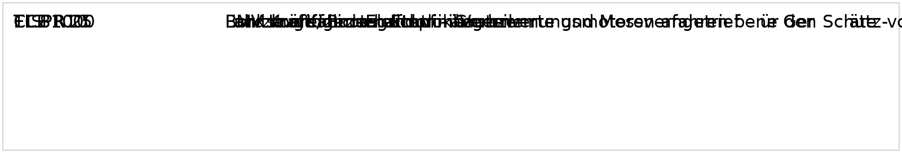
  </a>
  <figcaption>Figure <code>12_2_1</code> · BT-LAH-EMV-12 — <a href="../../docs/public/assets/BT-LAH-Modul_EMV_Lenkhilfe_2.5_EXERPT_20160509/12_2_1.png" target="_blank" rel="noopener">open full size</a>  Embedded source: <a href="../../docs/public/assets/BT-LAH-Modul_EMV_Lenkhilfe_2.5_EXERPT_20160509/12_2_1.bin" download>source <code>12_2_1.bin</code></a></figcaption>
</figure>

Transcription (English, machine-translated — searchable text)

TL 81000 EMC of motor vehicle electronics components ECE R10EMV Motor Vehicle Directive CISPR 25 vehicles, boats and internal combustion engines - Radio interference properties - Limit values and measurement methods for the protection of an On-board receivers

| | |
|---|---|
| Validity | valid (DE: gültig) |
| Status VW | to evaluate |
| Status supplier | agreed |

<code>BT-LAH-EMV-13</code> <code>Anforderung</code> · requirement valid VW: to evaluate Supplier: partly agreed

In addition, the EMC-specific requirements of the following documents must be complied with:

Group Performance Specifications for CAN systems

LIN Group Performance Specification

MOST Group Performance Specification

FlexRay Group Performance Specification

Ethernet/IP-Communication Group Performance Specification

<figure class="req-figure" id="fig-13_2_1">
  
  <figcaption>Figure <code>13_2_1</code> · BT-LAH-EMV-13 — <a href="../../docs/public/assets/BT-LAH-Modul_EMV_Lenkhilfe_2.5_EXERPT_20160509/13_2_1.png" target="_blank" rel="noopener">open full size</a>  Embedded source: <a href="../../docs/public/assets/BT-LAH-Modul_EMV_Lenkhilfe_2.5_EXERPT_20160509/13_2_1.bin" download>source <code>13_2_1.bin</code></a></figcaption>
</figure>

Transcription (English, machine-translated — searchable text)

Group - Load books for CAN systems LIN Group debits bulletin MOST Group Property Bulletin Flexray Group Property Book Group Property Issue Ethernet/IP Communication

| | |
|---|---|
| Validity | valid (DE: gültig) |
| Status VW | to evaluate |
| Status supplier | partly agreed |

Comments

<strong>Nexteer:</strong> noch nicht final analysiert

<code>BT-LAH-EMV-14</code> <code>Anforderung</code> · requirement valid VW: to evaluate Supplier: agreed

As of submission of the qualification report, the contractor must notify the department responsible for the EMC release of any modifications to hardware and software using a continuously updated revision list (part history). Any costs incurred in the EMC department for follow-up tests will be paid for by the party that caused these costs.

| | |
|---|---|
| Validity | valid (DE: gültig) |
| Status VW | to evaluate |
| Status supplier | agreed |

<code>BT-LAH-EMV-15</code> <code>Information</code> · information valid VW: not to evaluate Supplier: agreed

In the course of the development of electronic control units (ECUs), the purchaser will perform one preliminary measurement of interference emission/interference immunity/electrostatic discharge (ESD) and one release measurement of interference emission/interference immunity/ESD for the contractor free of charge.

| | |
|---|---|
| Validity | valid (DE: gültig) |
| Status VW | not to evaluate |
| Status supplier | agreed |

<code>BT-LAH-EMV-866</code> <code>Anforderung</code> · requirement valid VW: to evaluate Supplier: agreed

The contractor's responsible hardware and software developer must be present for the EMC vehicle measurements (if necessary, an EMC expert must be consulted). If required, the expert is to record specific assembly parameters and create a detailed inspection report based on them.

| | |
|---|---|
| Validity | valid (DE: gültig) |
| Status VW | to evaluate |
| Status supplier | agreed |

<code>BT-LAH-EMV-16</code> <code>Anforderung</code> · requirement valid VW: to evaluate Supplier: agreed

If the EMC department has not received a complete EMC qualification report one week before the agreed date for the vehicle measurement, the vehicle measurement can be canceled and the costs will be covered by the contractor.

| | |
|---|---|
| Validity | valid (DE: gültig) |
| Status VW | to evaluate |
| Status supplier | agreed |

<code>BT-LAH-EMV-17</code> <code>Anforderung</code> · requirement valid VW: to evaluate Supplier: agreed

The appropriate Volkswagen Group EMC department carries out measurements on the vehicle only after the EMC qualification report has been checked. A release is granted only if component measurements (EMC qualification report), EMC vehicle release measurements, and any subjective aural evaluations have been completed with positive results.

| | |
|---|---|
| Validity | valid (DE: gültig) |
| Status VW | to evaluate |
| Status supplier | agreed |

<code>BT-LAH-EMV-18</code> <code>Anforderung</code> · requirement valid VW: to evaluate Supplier: agreed

For EMC vehicle measurements, the contractor must provide appropriate, up-to-date ECUs with associated software or special software (e.g., time-out time) free of charge for each sample version.

| | |
|---|---|
| Validity | valid (DE: gültig) |
| Status VW | to evaluate |
| Status supplier | agreed |

### **2.1 Description of the component/overall system**

<code>BT-LAH-EMV-19</code> <code>Überschrift</code> · heading valid VW: not to evaluate Supplier: agreed — <strong><strong>2.1 Description of the component/overall system</strong></strong>

| | |
|---|---|
| Validity | valid (DE: gültig) |
| Status VW | not to evaluate |
| Status supplier | agreed |

<code>BT-LAH-EMV-869</code> <code>Information</code> · information valid VW: not to evaluate Supplier: agreed

The overall system is defined/described in consultation with the purchaser in the EMC project meeting and in the EMC test plan.

| | |
|---|---|
| Validity | valid (DE: gültig) |
| Status VW | not to evaluate |
| Status supplier | agreed |

<code>BT-LAH-EMV-870</code> <code>Anforderung</code> · requirement valid VW: to evaluate Supplier: agreed

The EMC component tests must be carried out in the overall system at the most critical system status for the EMC property to be tested. The operating conditions must be as close to reality as possible. This includes all modules integrated into the component and the connected peripheral devices (original loads or devices for generating a braking torque, etc.).

| | |
|---|---|
| Validity | valid (DE: gültig) |
| Status VW | to evaluate |
| Status supplier | agreed |

## 3 System-specific EMC requirements

<code>BT-LAH-EMV-21</code> <code>Überschrift</code> · heading valid VW: not to evaluate Supplier: agreed — <strong>3 System-specific EMC requirements</strong>

| | |
|---|---|
| Validity | valid (DE: gültig) |
| Status VW | not to evaluate |
| Status supplier | agreed |

<code>BT-LAH-EMV-1101</code> <code>Anforderung</code> · requirement valid VW: to evaluate Supplier: agreed — <strong><strong>3.1 Special requirements based on lessons learned</strong></strong>

| | |
|---|---|
| Validity | valid (DE: gültig) |
| Status VW | to evaluate |
| Status supplier | agreed |

<code>BT-LAH-EMV-1103</code> <code>Anforderung</code> · requirement valid VW: to evaluate Supplier: agreed

Have any special EMC requirements derived from lessons learned been considered in this Performance Specification: No

| | |
|---|---|
| Validity | valid (DE: gültig) |
| Status VW | to evaluate |
| Status supplier | agreed |

### **3.2 Classification of functional influences**

<code>BT-LAH-EMV-22</code> <code>Überschrift</code> · heading valid VW: not to evaluate Supplier: agreed — <strong><strong>3.2 Classification of functional influences</strong></strong>

| | |
|---|---|
| Validity | valid (DE: gültig) |
| Status VW | not to evaluate |
| Status supplier | agreed |

<code>BT-LAH-EMV-23</code> <code>Anforderung</code> · requirement valid VW: to evaluate Supplier: agreed

Functional influences must be classified as per the applicable Technical Supply Specifications (TLs) using the functional statuses A to C or the "Function Performance Status Classifications (FPSC)" described in ISO 11452-1:

**Classification:	To be applied to TL:	As defined in the TL	Additions/specifications**

Functional status
A to C	TL 81000,
 "Pulses" section	x	All functions must be complied with according to the Function Performance Specification. Specific functional statuses must be agreed upon with the appropriate EMC and system specialists.
If no special agreement is made, functional status A applies by default.

Categories 1 to 3 (FPSC)	TL 81000
"Interference immunity" and "ESD" sections	x	The automotive manufacturer alone is responsible for categorizing a component or system function and any effects that may occur, at the latest when the effect becomes known.
Should no category be allocated to a function or effect, category 3 is always used.

Note: Sleep mode, bus idle, and quiescent current must be checked after the tests.

<figure class="req-figure" id="fig-23_2_1">
  <a href="../../docs/public/assets/BT-LAH-Modul_EMV_Lenkhilfe_2.5_EXERPT_20160509/23_2_1.png" target="_blank" rel="noopener">
    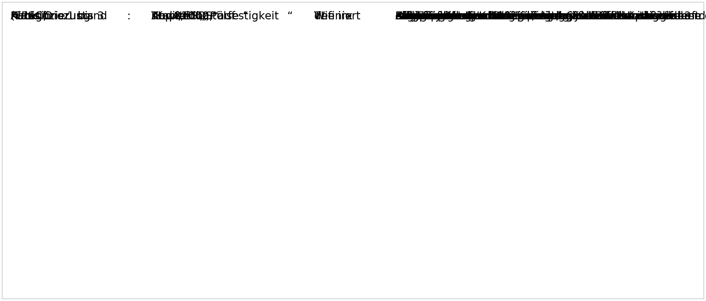
  </a>
  <figcaption>Figure <code>23_2_1</code> · BT-LAH-EMV-23 — <a href="../../docs/public/assets/BT-LAH-Modul_EMV_Lenkhilfe_2.5_EXERPT_20160509/23_2_1.png" target="_blank" rel="noopener">open full size</a>  Embedded source: <a href="../../docs/public/assets/BT-LAH-Modul_EMV_Lenkhilfe_2.5_EXERPT_20160509/23_2_1.bin" download>source <code>23_2_1.bin</code></a></figcaption>
</figure>

Transcription (English, machine-translated — searchable text)

Classification: Applicable to How to add / specify TL: TL defined Function statusTL81000, x All functions must be specified according to the functional load specification A to C Chapter "Pulse" must be accompanied by the EMC and system manager The Commission is not prepared to accept this. If no vote has been taken, the standard Condition A. Category 1 to 3 TL81000 x The classification of functions of a component; or (FPSC) Chapter "Strengthening of a system and effects occurring in the and ‘ESD' categories, the only The latest available data on the vehicle manufacturer's Effect fixed. If for a function or effect no The category is generally classified in category 3 The Commission has been involved in the implementation of the programme.

| | |
|---|---|
| Validity | valid (DE: gültig) |
| Status VW | to evaluate |
| Status supplier | agreed |

### **3.3 Interference emission of supply cable inputs (TL 81000, "Pulses" section)**

<code>BT-LAH-EMV-24</code> <code>Überschrift</code> · heading valid VW: not to evaluate Supplier: agreed — <strong><strong>3.3 Interference emission of supply cable inputs (TL 81000, "Pulses" section)</strong></strong>

| | |
|---|---|
| Validity | valid (DE: gültig) |
| Status VW | not to evaluate |
| Status supplier | agreed |

<code>BT-LAH-EMV-26</code> <code>Anforderung</code> · requirement valid VW: to evaluate Supplier: agreed

If there are no additional specifications, the requirements of TL 81000 apply.

| | |
|---|---|
| Validity | valid (DE: gültig) |
| Status VW | to evaluate |
| Status supplier | agreed |

<code>BT-LAH-EMV-1049</code> <code>Anforderung</code> · requirement valid VW: to evaluate Supplier: agreed

Do the tests have to be conducted using an electronic switch: **Yes**

| | |
|---|---|
| Validity | valid (DE: gültig) |
| Status VW | to evaluate |
| Status supplier | agreed |

<code>BT-LAH-EMV-1050</code> <code>Anforderung</code> · requirement valid VW: to evaluate Supplier: agreed

Do the tests have to be conducted using a mechanical switch: No

| | |
|---|---|
| Validity | valid (DE: gültig) |
| Status VW | to evaluate |
| Status supplier | agreed |

### **3.4 Interference immunity of supply cable inputs (TL 81000, "Pulses" section)**

<code>BT-LAH-EMV-27</code> <code>Überschrift</code> · heading valid VW: not to evaluate Supplier: agreed — <strong><strong>3.4 Interference immunity of supply cable inputs (TL 81000, "Pulses" section)</strong></strong>

| | |
|---|---|
| Validity | valid (DE: gültig) |
| Status VW | not to evaluate |
| Status supplier | agreed |

<code>BT-LAH-EMV-28</code> <code>Anforderung</code> · requirement valid VW: to evaluate Supplier: agreed

**Test pulse	Functional status	Additions/details**

1	C (A)	A test is possible without power switch-off for 200 ms; functional status A applies in this case.
If the device is operated via T.30 and continues operation when the ignition is turned off, all affected inputs (e.g., T.15, T.75, T.58d) must be tested with 200 ms.

6	A

2	A

3a	A

3b	A

<figure class="req-figure" id="fig-28_2_1">
  <a href="../../docs/public/assets/BT-LAH-Modul_EMV_Lenkhilfe_2.5_EXERPT_20160509/28_2_1.png" target="_blank" rel="noopener">
    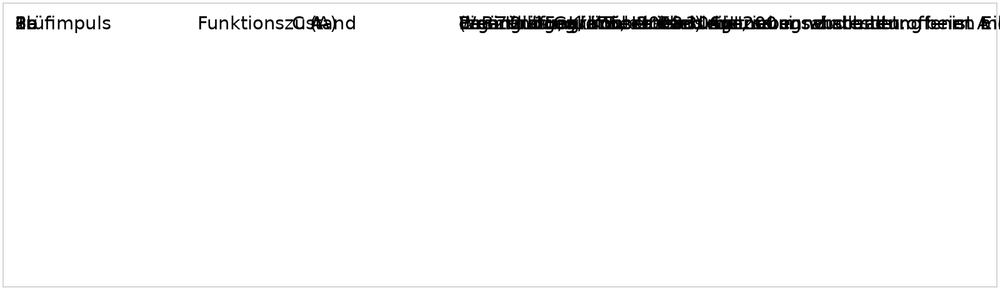
  </a>
  <figcaption>Figure <code>28_2_1</code> · BT-LAH-EMV-28 — <a href="../../docs/public/assets/BT-LAH-Modul_EMV_Lenkhilfe_2.5_EXERPT_20160509/28_2_1.png" target="_blank" rel="noopener">open full size</a>  Embedded source: <a href="../../docs/public/assets/BT-LAH-Modul_EMV_Lenkhilfe_2.5_EXERPT_20160509/28_2_1.bin" download>source <code>28_2_1.bin</code></a></figcaption>
</figure>

Transcription (English, machine-translated — searchable text)

Test pulseFunctional stateSupplements/concretes 1 C (A) A test without 200 ms voltage shut-off is possible, then functional state A applies. If the device is operated via Kl. 30 and when switching off the ignition remains in operation, all the affected inputs are (e.g. Kl. 15, Kl. 75, Kl. 58d) with 200 ms. 6 A 2 A 3a A 3b A

| | |
|---|---|
| Validity | valid (DE: gültig) |
| Status VW | to evaluate |
| Status supplier | agreed |

### **3.5 Interference immunity of sensor cable inputs (TL 81000, "Pulses" section)**

<code>BT-LAH-EMV-29</code> <code>Überschrift</code> · heading valid VW: not to evaluate Supplier: agreed — <strong><strong>3.5 Interference immunity of sensor cable inputs (TL 81000, "Pulses" section)</strong></strong>

| | |
|---|---|
| Validity | valid (DE: gültig) |
| Status VW | not to evaluate |
| Status supplier | agreed |

<code>BT-LAH-EMV-31</code> <code>Anforderung</code> · requirement valid VW: to evaluate Supplier: agreed

**Test pulse	Functional status	Test method with	Additions/details**

1	A	BCI

2	A	BCI

3a	A	Coupling clamp

3b	A	Coupling clamp

<figure class="req-figure" id="fig-31_2_1">
  <a href="../../docs/public/assets/BT-LAH-Modul_EMV_Lenkhilfe_2.5_EXERPT_20160509/31_2_1.png" target="_blank" rel="noopener">
    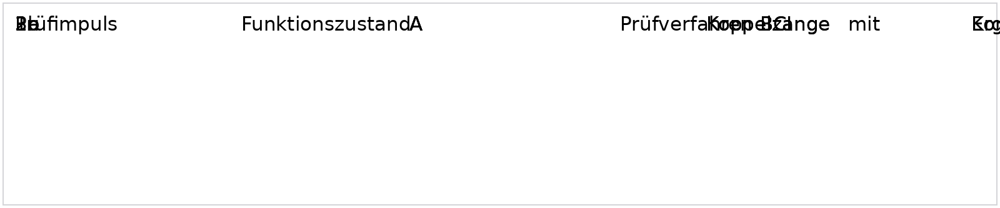
  </a>
  <figcaption>Figure <code>31_2_1</code> · BT-LAH-EMV-31 — <a href="../../docs/public/assets/BT-LAH-Modul_EMV_Lenkhilfe_2.5_EXERPT_20160509/31_2_1.png" target="_blank" rel="noopener">open full size</a>  Embedded source: <a href="../../docs/public/assets/BT-LAH-Modul_EMV_Lenkhilfe_2.5_EXERPT_20160509/31_2_1.bin" download>source <code>31_2_1.bin</code></a></figcaption>
</figure>

Transcription (English, machine-translated — searchable text)

Test pulseFunctional stateTesting procedures with additions/ Concretements 1 A BCI 2 A BCI 3a A coupling tongs 3b A coupling tongs

| | |
|---|---|
| Validity | valid (DE: gültig) |
| Status VW | to evaluate |
| Status supplier | agreed |

### **3.6 Interference emission (TL 81000, "Emitted interference" section)**

<code>BT-LAH-EMV-32</code> <code>Überschrift</code> · heading valid VW: not to evaluate Supplier: agreed — <strong><strong>3.6 Interference emission (TL 81000, "Emitted interference" section)</strong></strong>

| | |
|---|---|
| Validity | valid (DE: gültig) |
| Status VW | not to evaluate |
| Status supplier | agreed |

<code>BT-LAH-EMV-872</code> <code>Anforderung</code> · requirement valid VW: to evaluate Supplier: agreed

The measurements must be performed as per the procedures listed in TL 81000. Unless described otherwise, the corresponding limits as per TL 81000 apply. This applies both to the services and bands and the basic limits. The specifications of CISPR 25 form the basis for all component measuring procedures, except for measurements with the capacitive coupling clamp.

| | |
|---|---|
| Validity | valid (DE: gültig) |
| Status VW | to evaluate |
| Status supplier | agreed |

#### **3.6.1 Standard test conditions for interference emission**

<code>BT-LAH-EMV-1033</code> <code>Überschrift</code> · heading valid VW: not to evaluate Supplier: agreed — <strong><strong>3.6.1 Standard test conditions for interference emission</strong></strong>

| | |
|---|---|
| Validity | valid (DE: gültig) |
| Status VW | not to evaluate |
| Status supplier | agreed |

<code>BT-LAH-EMV-1020</code> <code>Anforderung</code> · requirement valid VW: to evaluate Supplier: agreed

During the interference emission test, it must be ensured that the DUT transmits the maximum interference power possible during operation. At least all standard/typical operating states must be tested. To be documented: the maximum interference emissions that occur during operating states that are not normal for the DUT. Appropriate measures must be agreed upon with the EMC department. In particular, regardless of the specifications listed in TL 81000 and CISPR 25, the most critical supply voltage for interference emissions must be determined and the resulting interference emission documented.

| | |
|---|---|
| Validity | valid (DE: gültig) |
| Status VW | to evaluate |
| Status supplier | agreed |

<code>BT-LAH-EMV-1068</code> <code>Anforderung</code> · requirement valid VW: to evaluate Supplier: agreed

The maximum frequency increments and minimum measuring times are specified in TL 81000.

| | |
|---|---|
| Validity | valid (DE: gültig) |
| Status VW | to evaluate |
| Status supplier | agreed |

<code>BT-LAH-EMV-1113</code> <code>Anforderung</code> · requirement valid VW: to evaluate Supplier: agreed

During C-sample qualification, at least one sample over the entire frequency rangemust be measured using the standard measuring procedure (measurements in the frequency range). The following applies to all other C-sample and the B-sample qualifications: if the FFT measuring procedure (measurements in the time range) is applied, the system used and the parameters in the time range ("frequency window", etc.) must be documented completely. If, during B-sample qualification, measurements are also used for the release-relevant C-sample qualification (e.g., measurements in the high frequency range), these measurements must be performed at least once over the entire frequency range using the standard measuring procedure (measurements in the frequency range).

| | |
|---|---|
| Validity | valid (DE: gültig) |
| Status VW | to evaluate |
| Status supplier | agreed |

<code>BT-LAH-EMV-35</code> <code>Anforderung</code> · requirement valid VW: to evaluate Supplier: agreed

If the component includes a function that is classified as a short-term interference source, the limit classes for this function may only be reduced upon written approval by the EMC department.

| | |
|---|---|
| Validity | valid (DE: gültig) |
| Status VW | to evaluate |
| Status supplier | agreed |

#### **3.6.2 Applicable measuring procedures**

<code>BT-LAH-EMV-1028</code> <code>Überschrift</code> · heading valid VW: not to evaluate Supplier: agreed — <strong><strong>3.6.2 Applicable measuring procedures</strong></strong>

| | |
|---|---|
| Validity | valid (DE: gültig) |
| Status VW | not to evaluate |
| Status supplier | agreed |

<code>BT-LAH-EMV-33</code> <code>Anforderung</code> · requirement valid VW: to evaluate Supplier: agreed

The interference emissions must be examined using the component measuring procedures below.
The measuring procedures marked "1" are mandatory for the radio services for which they are suitable.
The measuring procedures marked "2" can be used optionally following consultation with the responsible EMC component coordinator.

**Measuring method	Suitable for frequencies**

**from	to**

**Artificial network**	**1	100 kHz	150 MHz**

**Antenna method	1	100 kHz	6 GHz**

Stripline	2	100 kHz	960 MHz

Capacitive coupling clamp	2	100 kHz	30 MHz

Clamp-on current probe	2	30 MHz	108 MHz

<figure class="req-figure" id="fig-33_2_1">
  <a href="../../docs/public/assets/BT-LAH-Modul_EMV_Lenkhilfe_2.5_EXERPT_20160509/33_2_1.png" target="_blank" rel="noopener">
    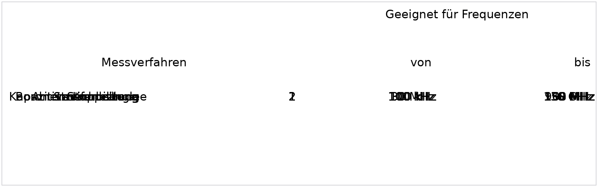
  </a>
  <figcaption>Figure <code>33_2_1</code> · BT-LAH-EMV-33 — <a href="../../docs/public/assets/BT-LAH-Modul_EMV_Lenkhilfe_2.5_EXERPT_20160509/33_2_1.png" target="_blank" rel="noopener">open full size</a>  Embedded source: <a href="../../docs/public/assets/BT-LAH-Modul_EMV_Lenkhilfe_2.5_EXERPT_20160509/33_2_1.bin" download>source <code>33_2_1.bin</code></a></figcaption>
</figure>

Transcription (English, machine-translated — searchable text)

Suitable for frequencies Measurement methods from to On-board power supply replica1 100 kHz150 MHz Antenna method1 100 kHz6 GHz Strip line2 100 kHz960 MHz Capacitive coupling tongs2 100 kHz30 MHz Current pliers2 30 MHz108 MHz

| | |
|---|---|
| Validity | valid (DE: gültig) |
| Status VW | to evaluate |
| Status supplier | agreed |

#### **3.6.3 Conducted interference emission**

<code>BT-LAH-EMV-36</code> <code>Überschrift</code> · heading valid VW: not to evaluate Supplier: agreed — <strong><strong>3.6.3 Conducted interference emission</strong></strong>

| | |
|---|---|
| Validity | valid (DE: gültig) |
| Status VW | not to evaluate |
| Status supplier | agreed |

#### ***3.6.3.1 Artificial network (AN test)***

<code>BT-LAH-EMV-1029</code> <code>Überschrift</code> · heading valid VW: not to evaluate Supplier: agreed — <strong><strong>*3.6.3.1 Artificial network (AN test)</strong>*</strong>

| | |
|---|---|
| Validity | valid (DE: gültig) |
| Status VW | not to evaluate |
| Status supplier | agreed |

<code>BT-LAH-EMV-1023</code> <code>Anforderung</code> · requirement valid VW: to evaluate Supplier: agreed

If there are no additional specifications, the requirements of TL 81000 apply.
Do limit classes deviating from those defined as standard in TL 81000 (in bold type) have to be complied with: **No**

| | |
|---|---|
| Validity | valid (DE: gültig) |
| Status VW | to evaluate |
| Status supplier | agreed |

#### ***3.6.3.2 Capacitive coupling clamp (CV test)***

<code>BT-LAH-EMV-886</code> <code>Überschrift</code> · heading valid VW: not to evaluate Supplier: agreed — <strong><strong>*3.6.3.2 Capacitive coupling clamp (CV test)</strong>*</strong>

| | |
|---|---|
| Validity | valid (DE: gültig) |
| Status VW | not to evaluate |
| Status supplier | agreed |

<code>BT-LAH-EMV-1024</code> <code>Anforderung</code> · requirement valid VW: to evaluate Supplier: agreed

If there are no additional specifications, the requirements of TL 81000 apply.
Do limit classes deviating from those defined as standard in TL 81000 (in bold type) have to be complied with: **No**

| | |
|---|---|
| Validity | valid (DE: gültig) |
| Status VW | to evaluate |
| Status supplier | agreed |

#### ***3.6.3.3 Clamp-on current probe (CP test)***

<code>BT-LAH-EMV-889</code> <code>Überschrift</code> · heading valid VW: not to evaluate Supplier: agreed — <strong><strong>*3.6.3.3 Clamp-on current probe (CP test)</strong>*</strong>

| | |
|---|---|
| Validity | valid (DE: gültig) |
| Status VW | not to evaluate |
| Status supplier | agreed |

<code>BT-LAH-EMV-1025</code> <code>Anforderung</code> · requirement valid VW: to evaluate Supplier: agreed

If there are no additional specifications, the requirements of TL 81000 apply.
Do limit classes deviating from those defined as standard in TL 81000 (in bold type) have to be complied with: **No**

| | |
|---|---|
| Validity | valid (DE: gültig) |
| Status VW | to evaluate |
| Status supplier | agreed |

#### **3.6.4 Radiated interference emission**

<code>BT-LAH-EMV-39</code> <code>Überschrift</code> · heading valid VW: not to evaluate Supplier: agreed — <strong><strong>3.6.4 Radiated interference emission</strong></strong>

| | |
|---|---|
| Validity | valid (DE: gültig) |
| Status VW | not to evaluate |
| Status supplier | agreed |

#### ***3.6.4.1 Antenna method (ALSE test, frequency range 100 kHz – 6 GHz)***

<code>BT-LAH-EMV-42</code> <code>Überschrift</code> · heading valid VW: not to evaluate Supplier: agreed — <strong><strong>*3.6.4.1 Antenna method (ALSE test, frequency range 100 kHz – 6 GHz)</strong>*</strong>

| | |
|---|---|
| Validity | valid (DE: gültig) |
| Status VW | not to evaluate |
| Status supplier | agreed |

<code>BT-LAH-EMV-894</code> <code>Information</code> · information valid VW: not to evaluate Supplier: agreed

Measurements carried out using the 1-m antenna method may be performed in both fully anechoic and semi anechoic chambers despite the stipulations of the CISPR 25, 3 rd edition.

| | |
|---|---|
| Validity | valid (DE: gültig) |
| Status VW | not to evaluate |
| Status supplier | agreed |

<code>BT-LAH-EMV-43</code> <code>Anforderung</code> · requirement valid VW: to evaluate Supplier: agreed

If there are no additional specifications, the requirements of TL 81000 apply.
Do limit classes deviating from those defined as standard in TL 81000 (in bold type) have to be complied with: **No**

| | |
|---|---|
| Validity | valid (DE: gültig) |
| Status VW | to evaluate |
| Status supplier | agreed |

#### ***3.6.4.2 Stripline (SL test)***

<code>BT-LAH-EMV-44</code> <code>Überschrift</code> · heading valid VW: not to evaluate Supplier: agreed — <strong><strong>*3.6.4.2 Stripline (SL test)</strong>*</strong>

| | |
|---|---|
| Validity | valid (DE: gültig) |
| Status VW | not to evaluate |
| Status supplier | agreed |

<code>BT-LAH-EMV-45</code> <code>Anforderung</code> · requirement valid VW: to evaluate Supplier: agreed

If there are no additional specifications, the requirements of TL 81000 apply.
Do limit classes deviating from those defined as standard in TL 81000 (in bold type) have to be complied with: **No**

| | |
|---|---|
| Validity | valid (DE: gültig) |
| Status VW | to evaluate |
| Status supplier | agreed |

### **3.7 Radiated interference (TL 81000, "Interference immunity" section)**

<code>BT-LAH-EMV-47</code> <code>Überschrift</code> · heading valid VW: not to evaluate Supplier: agreed — <strong><strong>3.7 Radiated interference (TL 81000, "Interference immunity" section)</strong></strong>

| | |
|---|---|
| Validity | valid (DE: gültig) |
| Status VW | not to evaluate |
| Status supplier | agreed |

<code>BT-LAH-EMV-48</code> <code>Anforderung</code> · requirement valid VW: to evaluate Supplier: agreed

The interference immunity must be examined using a combination of the component testing methods below. The frequency range between 0.1 MHz and 3 GHz must be covered.
The measuring procedures marked with "1" are mandatory.
The measuring procedures marked "2" can be used optionally following consultation with the responsible EMC component coordinator.

Table: Test methods that can be used for interference immunity tests

**Method	Frequency range [MHz]	Application	Comments**

**Antenna	200 - 3 000	1**

**BCI	0.1 - 400	1**

Stripline	0.1 - 400	 2

<figure class="req-figure" id="fig-48_2_1">
  <a href="../../docs/public/assets/BT-LAH-Modul_EMV_Lenkhilfe_2.5_EXERPT_20160509/48_2_1.png" target="_blank" rel="noopener">
    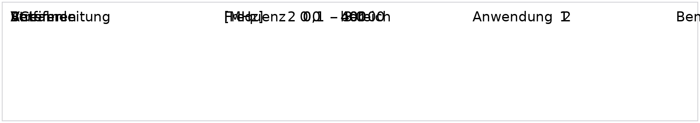
  </a>
  <figcaption>Figure <code>48_2_1</code> · BT-LAH-EMV-48 — <a href="../../docs/public/assets/BT-LAH-Modul_EMV_Lenkhilfe_2.5_EXERPT_20160509/48_2_1.png" target="_blank" rel="noopener">open full size</a>  Embedded source: <a href="../../docs/public/assets/BT-LAH-Modul_EMV_Lenkhilfe_2.5_EXERPT_20160509/48_2_1.bin" download>source <code>48_2_1.bin</code></a></figcaption>
</figure>

Transcription (English, machine-translated — searchable text)

ProcedureRadio frequency application [MHz] Antenna 200 -3000 1 BCI 0,1-400 1 Strip line0,1-400 2

| | |
|---|---|
| Validity | valid (DE: gültig) |
| Status VW | to evaluate |
| Status supplier | agreed |

<code>BT-LAH-EMV-50</code> <code>Anforderung</code> · requirement valid VW: to evaluate Supplier: agreed

For component tests, functional status A or category 3 in accordance with FPSC always applies as per the Feature Performance Specification (see also: table in section 3.2). Deviations require the approval of the appropriate EMC department.

| | |
|---|---|
| Validity | valid (DE: gültig) |
| Status VW | to evaluate |
| Status supplier | agreed |

<code>BT-LAH-EMV-51</code> <code>Anforderung</code> · requirement valid VW: to evaluate Supplier: agreed

The interference immunity is to be tested with different modulation types. The corresponding settings and frequency ranges are specified in TL 81000.

| | |
|---|---|
| Validity | valid (DE: gültig) |
| Status VW | to evaluate |
| Status supplier | agreed |

### **3.8 Electrostatic discharge (ESD, see TL 81000, "ESD" section)**

<code>BT-LAH-EMV-52</code> <code>Überschrift</code> · heading valid VW: not to evaluate Supplier: agreed — <strong><strong>3.8 Electrostatic discharge (ESD, see TL 81000, "ESD" section)</strong></strong>

| | |
|---|---|
| Validity | valid (DE: gültig) |
| Status VW | not to evaluate |
| Status supplier | agreed |

<code>BT-LAH-EMV-53</code> <code>Anforderung</code> · requirement valid VW: to evaluate Supplier: partly agreed

All sides and metal surfaces (e.g., heat sinks, bolts, driving axle, retainer) of the electronic control unit must be tested in the packaging/handling test and at system level.
All contacts must be tested, without exception, when testing the contact discharges on connector pins.
Bus interfaces and freely accessible interfaces (e.g., jack plug) must be designed for maximum ESD immunity by means of appropriate circuitry. However, these parts must first be tested without installed ESD protection devices/capacitors. See also the LIN/CAN/FlexRay Bus Performance Specifications and the circuitry and released protection elements contained therein.

| | |
|---|---|
| Validity | valid (DE: gültig) |
| Status VW | to evaluate |
| Status supplier | partly agreed |

Comments

<strong>Nexteer:</strong> noch nicht final analysiert

<code>BT-LAH-EMV-56</code> <code>Anforderung</code> · requirement valid VW: to evaluate Supplier: agreed

Do test voltages other than standard values apply: **No**

| | |
|---|---|
| Validity | valid (DE: gültig) |
| Status VW | to evaluate |
| Status supplier | agreed |

### **3.9 Immunity to magnetic fields (TL 81000, "Interference immunity" section, "Magnetic field test" subsection)**

<code>BT-LAH-EMV-846</code> <code>Überschrift</code> · heading valid VW: not to evaluate Supplier: agreed — <strong><strong>3.9 Immunity to magnetic fields (TL 81000, "Interference immunity" section, "Magnetic field test" subsection)</strong></strong>

| | |
|---|---|
| Validity | valid (DE: gültig) |
| Status VW | not to evaluate |
| Status supplier | agreed |

<code>BT-LAH-EMV-847</code> <code>Anforderung</code> · requirement valid VW: to evaluate Supplier: agreed

Do magnetic field tests as per TL 81000 have to be conducted: **Yes**

| | |
|---|---|
| Validity | valid (DE: gültig) |
| Status VW | to evaluate |
| Status supplier | agreed |

<code>BT-LAH-EMV-848</code> <code>Anforderung</code> · requirement valid VW: to evaluate Supplier: agreed

Do test field strength values other than standard values apply: **No**

| | |
|---|---|
| Validity | valid (DE: gültig) |
| Status VW | to evaluate |
| Status supplier | agreed |

<code>BT-LAH-EMV-1108</code> <code>Anforderung</code> · requirement valid VW: to evaluate Supplier: agreed — <strong><strong>3.10 Immunity to electromagnetic interference from portable transmitters (TL 81000, "Interference immunity" section, "Mobile radio test" subsection)</strong></strong>

| | |
|---|---|
| Validity | valid (DE: gültig) |
| Status VW | to evaluate |
| Status supplier | agreed |

Comments

<strong>Nexteer:</strong> Nicht zutreffend für SPEPS &amp; DPEPS

<code>BT-LAH-EMV-1109</code> <code>Anforderung</code> · requirement valid VW: to evaluate Supplier: agreed

Do mobile radio tests as per TL 81000 have to be performed: **This applies to power steering systems in the vehicle interior.**

| | |
|---|---|
| Validity | valid (DE: gültig) |
| Status VW | to evaluate |
| Status supplier | agreed |

Comments

<strong>Nexteer:</strong> Nicht zutreffend für SPEPS &amp; DPEPS

<code>BT-LAH-EMV-1110</code> <code>Anforderung</code> · requirement valid VW: to evaluate Supplier: agreed

Do test field strength values other than the standard values apply: **No**

| | |
|---|---|
| Validity | valid (DE: gültig) |
| Status VW | to evaluate |
| Status supplier | agreed |

<code>BT-LAH-EMV-1073</code> <code>Anforderung</code> · requirement valid VW: to evaluate Supplier: agreed — <strong>4 EMC requirements specific to high voltages</strong>

| | |
|---|---|
| Validity | valid (DE: gültig) |
| Status VW | to evaluate |
| Status supplier | agreed |

Comments

<strong>Nexteer:</strong> Nicht zutreffend für SPEPS &amp; DPEPS

<code>BT-LAH-EMV-1098</code> <code>Anforderung</code> · requirement valid VW: to evaluate Supplier: agreed

Does the "EMC High-Voltage" module have to be used because the component is connected to the high-voltage electric system: No

| | |
|---|---|
| Validity | valid (DE: gültig) |
| Status VW | to evaluate |
| Status supplier | agreed |

## 5 Additional EMC requirements

<code>BT-LAH-EMV-61</code> <code>Überschrift</code> · heading valid VW: not to evaluate Supplier: agreed — <strong>5 Additional EMC requirements</strong>

| | |
|---|---|
| Validity | valid (DE: gültig) |
| Status VW | not to evaluate |
| Status supplier | agreed |

### **5.1 Requirements for clocked voltages and currents on cables that are outside of devices**

<code>BT-LAH-EMV-62</code> <code>Überschrift</code> · heading valid VW: not to evaluate Supplier: agreed — <strong><strong>5.1 Requirements for clocked voltages and currents on cables that are outside of devices</strong></strong>

| | |
|---|---|
| Validity | valid (DE: gültig) |
| Status VW | not to evaluate |
| Status supplier | agreed |

<code>BT-LAH-EMV-63</code> <code>Anforderung</code> · requirement valid VW: to evaluate Supplier: partly agreed

**Category	Voltage rise and drop rate [dV/dt]	Current rise and drop rate [dI/dt]	Evaluation**

1	| dV/dt | ≤ 200 mV/µs	| dI/dt | ≤ 20 mA/µs	Permissible

2	0.2 V/µs &lt; | dV/dt | ≤ 10 V/µs	20 mA/µs &lt; | dI/dt | ≤ 100 mA/µs	Critical, notifiable

3	| dV/dt | &gt; 10 V/µs	| dI/dt | &gt; 100 mA/µs	Only permissible in exceptional cases provided a release has been granted

Category 2: 	Signals of category 2 must be indicated, e.g., to avoid wiring harness positions close to the antenna or to allow for other measures (twisting, package, etc.).
Category 3: 	These signals may be used within electronic control units. If violating the slew rate limitation outside of the component cannot be avoided for functional reasons, effective actions against these interferences must be developed and their effect must be demonstrated. All measures must be approved by the EMC department.

<figure class="req-figure" id="fig-63_2_1">
  <a href="../../docs/public/assets/BT-LAH-Modul_EMV_Lenkhilfe_2.5_EXERPT_20160509/63_2_1.png" target="_blank" rel="noopener">
    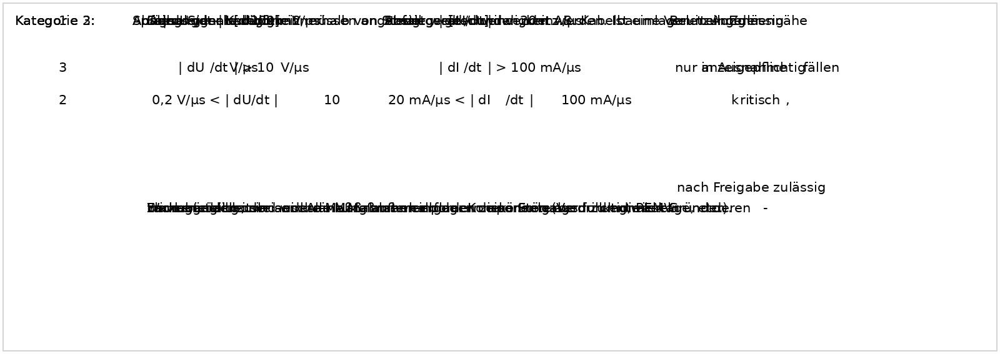
  </a>
  <figcaption>Figure <code>63_2_1</code> · BT-LAH-EMV-63 — <a href="../../docs/public/assets/BT-LAH-Modul_EMV_Lenkhilfe_2.5_EXERPT_20160509/63_2_1.png" target="_blank" rel="noopener">open full size</a>  Embedded source: <a href="../../docs/public/assets/BT-LAH-Modul_EMV_Lenkhilfe_2.5_EXERPT_20160509/63_2_1.bin" download>source <code>63_2_1.bin</code></a></figcaption>
</figure>

Transcription (English, machine-translated — searchable text)

CategoryUprising and Uprising and Assessment Waste speedWaste speed Voltage [dU/dt] Current [dI/dt] 1 2 0.2 V/μs &lt; V/μs notifiable 3 Approved after release Category 2: Category 2 signals must be displayed to, for example, wire harnesses near antennas to avoid or to plan other measures (drilling, package, etc.). Category 3: These signals may be used within ECUs. Partial flanking restriction outside the component for functional reasons In order to ensure that the measures taken to combat these disturbances are effective, the Commission shall: All measures require approval by the EMC Department.

| | |
|---|---|
| Validity | valid (DE: gültig) |
| Status VW | to evaluate |
| Status supplier | partly agreed |

Comments

<strong>Nexteer:</strong> noch nicht final analysiert

### **5.2 Requirements for power PWM frequencies**

<code>BT-LAH-EMV-66</code> <code>Überschrift</code> · heading valid VW: not to evaluate Supplier: agreed — <strong><strong>5.2 Requirements for power PWM frequencies</strong></strong>

| | |
|---|---|
| Validity | valid (DE: gültig) |
| Status VW | not to evaluate |
| Status supplier | agreed |

<code>BT-LAH-EMV-67</code> <code>Anforderung</code> · requirement valid VW: to evaluate Supplier: partly agreed

**Frequency [kHz]	Minimizing the subjective influence on AM radio reception**

n * 4.5 	For channel spacing of 9 kHz (ROW)

n * 5.0	For channel spacing of 10 kHz (NAR)

n = integer.  Deviation from basic frequency: max. 100 ppm (crystal stability)

Note: The harmonic components – which must also fall below the limits – must coincide precisely with the channel medium frequency since the audible effects are at their lowest level here.

<figure class="req-figure" id="fig-67_2_1">
  <a href="../../docs/public/assets/BT-LAH-Modul_EMV_Lenkhilfe_2.5_EXERPT_20160509/67_2_1.png" target="_blank" rel="noopener">
    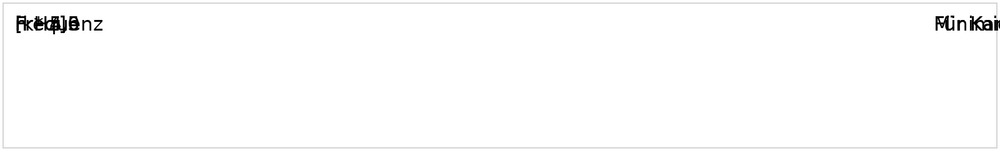
  </a>
  <figcaption>Figure <code>67_2_1</code> · BT-LAH-EMV-67 — <a href="../../docs/public/assets/BT-LAH-Modul_EMV_Lenkhilfe_2.5_EXERPT_20160509/67_2_1.png" target="_blank" rel="noopener">open full size</a>  Embedded source: <a href="../../docs/public/assets/BT-LAH-Modul_EMV_Lenkhilfe_2.5_EXERPT_20160509/67_2_1.bin" download>source <code>67_2_1.bin</code></a></figcaption>
</figure>

Transcription (English, machine-translated — searchable text)

Frequency Minimization of subjective influence on AM radio reception [kHz] n * 4,5 For channel grids 9 kHz (RdW) n * 5.0 For channel grids 10 kHz (NAR)

| | |
|---|---|
| Validity | valid (DE: gültig) |
| Status VW | to evaluate |
| Status supplier | partly agreed |

Comments

<strong>Nexteer:</strong> noch nicht final analysiert

<code>BT-LAH-EMV-68</code> <code>Anforderung</code> · requirement valid VW: to evaluate Supplier: partly agreed

Details must be agreed upon with the appropriate EMC department.

| | |
|---|---|
| Validity | valid (DE: gültig) |
| Status VW | to evaluate |
| Status supplier | partly agreed |

Comments

<strong>Nexteer:</strong> noch nicht final analysiert

### **5.3 Requirements for driver outputs**

<code>BT-LAH-EMV-1099</code> <code>Überschrift</code> · heading valid VW: not to evaluate Supplier: agreed — <strong><strong>5.3 Requirements for driver outputs</strong></strong>

| | |
|---|---|
| Validity | valid (DE: gültig) |
| Status VW | not to evaluate |
| Status supplier | agreed |

<code>BT-LAH-EMV-1100</code> <code>Anforderung</code> · requirement valid VW: to evaluate Supplier: agreed

All semiconductor driver outputs that drive the external periphery are to be equipped with a capacitor that has the appropriate dimensions and design. If the contractor can demonstrate that capacitors are not necessary to fulfill the EMC requirements both at the component level and at the vehicle level, then it is sufficient that provisions for capacitors are made.

| | |
|---|---|
| Validity | valid (DE: gültig) |
| Status VW | to evaluate |
| Status supplier | agreed |

### **5.4 Crystal frequencies**

<code>BT-LAH-EMV-69</code> <code>Überschrift</code> · heading valid VW: not to evaluate Supplier: agreed — <strong><strong>5.4 Crystal frequencies</strong></strong>

| | |
|---|---|
| Validity | valid (DE: gültig) |
| Status VW | not to evaluate |
| Status supplier | agreed |

<code>BT-LAH-EMV-70</code> <code>Anforderung</code> · requirement valid VW: to evaluate Supplier: agreed

The following crystal frequencies must not be used:

**Frequency [MHz]	Operating system that could malfunction**

4.10	Duplex distance, 31.7 MHz to 41 MHz two-way radio

4.60	Duplex distance, 2 m band (also 65.85 MHz, country-specific)

5.00	TV picture/sound carrier distance *)

7.60	Duplex distance, 70 cm amateur radio

9.80	Duplex distance, 4 m band (police, fire department, private mobile radio)

10.00	Duplex distance, 2 m band

10.70	Intermediate frequency, two-way radios and radios *)

21.40	Intermediate frequency, two-way radios

45.00	D-network telephone, short-range radio

55.00	Duplex distance, J-Tax

*) These frequencies may be used in individual cases following consultation with the appropriate EMC department.

Note: Radio systems are very sensitive to interference in the duplex and intermediate frequency ranges. When selecting the crystal elements, it must be ensured that the working frequency and its harmonic waves and resulting mixed frequencies do not coincide with the mentioned frequencies. The permissible safety margin must be at least +/-100 kHz.

<figure class="req-figure" id="fig-70_2_1">
  <a href="../../docs/public/assets/BT-LAH-Modul_EMV_Lenkhilfe_2.5_EXERPT_20160509/70_2_1.png" target="_blank" rel="noopener">
    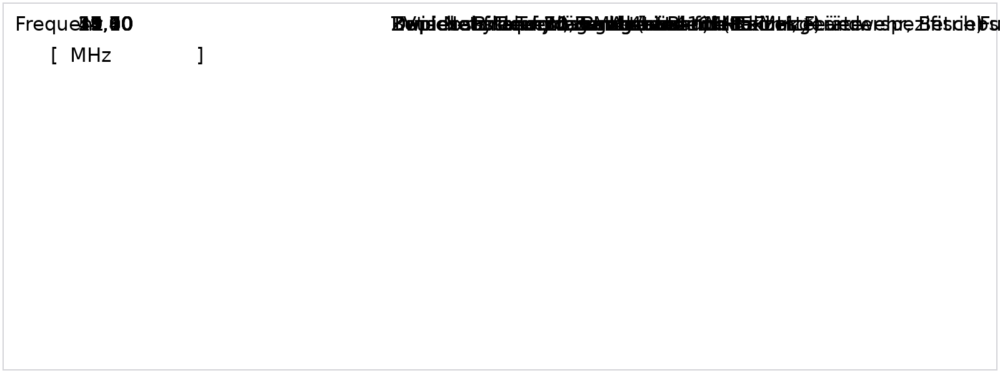
  </a>
  <figcaption>Figure <code>70_2_1</code> · BT-LAH-EMV-70 — <a href="../../docs/public/assets/BT-LAH-Modul_EMV_Lenkhilfe_2.5_EXERPT_20160509/70_2_1.png" target="_blank" rel="noopener">open full size</a>  Embedded source: <a href="../../docs/public/assets/BT-LAH-Modul_EMV_Lenkhilfe_2.5_EXERPT_20160509/70_2_1.bin" download>source <code>70_2_1.bin</code></a></figcaption>
</figure>

Transcription (English, machine-translated — searchable text)

Frequency Operating System that could be disturbed [MHz ] 4,10 duplex distance 31.7 MHz to 41 MHz radios 4,60 duplex distance 2m band (also 65.85 MHz, country specific) 5,00 TV image audio recording distance *) 7,60 duplex distance 70 cm Amateur radio 9.80 Duplex distance 4m band (police, fire brigade, operating radio) 10,00 duplex distance 2m band 10,70 Intermediary frequency radios and radios *) 21,40 Intermediary frequency radios 45,00 D -Net telephone, short range radio 55,00 duplex distance J-Tax

| | |
|---|---|
| Validity | valid (DE: gültig) |
| Status VW | to evaluate |
| Status supplier | agreed |

## 6 List of abbreviations

<code>BT-LAH-EMV-71</code> <code>Überschrift</code> · heading valid VW: not to evaluate Supplier: agreed — <strong>6 List of abbreviations</strong>

| | |
|---|---|
| Validity | valid (DE: gültig) |
| Status VW | not to evaluate |
| Status supplier | agreed |

<code>BT-LAH-EMV-1062</code> <code>Information</code> · information valid VW: not to evaluate Supplier: agreed

AMPS	Advanced Mobile Phone System

AV	Average detector

AN	Artificial network

BCI	Bulk current injection

BNN	Artificial network

BOS	Public Safety Organizations in Germany

BT-LAH	Component Performance Specification

CAN	Controller Area Network

CB	Citizens band

CDMA	Code division multiple access

CISPR	International Committee on Radio Interference

DAB	Digital Audio Broadcasting

DVB-T	Digital Video Broadcasting - Terrestrial

EMC	Electromagnetic compatibility

ESD	Electrostatic discharge

GPS	Global Positioning System

GSM	Global System for Mobile Communications

HV	High voltage

IBIS	Input/Output Buffer Information Specification

IMT-2000	International Mobile Telecommunications – 2000 (3rd generation)

ISM/SRD	Industrial, Scientific and Medical Band / Short Range Device

SW	Short wave

LIN	Local Interconnect Network

LTE	Long Term Evolution (4G 4th generation wireless communications)

LW	Long wave

MOST	Media Oriented Systems Transport

MW	Medium wave

P	Peak detector

PDC	Personal digital communication

PM	Pulse modulation

PWM	Pulse width modulation

QP	Quasi-peak detector

SDARS	Satellite Digital Audio Radio Services

SPICE	Software Process Improvement and Capability Determination

TEM	Transverse electromagnetic mode

TETRA	Terrestrial Trunked Radio

TL	Technical Supply Specification

TV	Television

VHF	Very high frequency

UMTS	Universal Mobile Telecommunications System

WDCMA	Wideband CDMA

WLAN	Wireless LAN

<figure class="req-figure" id="fig-1062_2_1">
  
  <figcaption>Figure <code>1062_2_1</code> · BT-LAH-EMV-1062 — <a href="../../docs/public/assets/BT-LAH-Modul_EMV_Lenkhilfe_2.5_EXERPT_20160509/1062_2_1.png" target="_blank" rel="noopener">open full size</a>  Embedded source: <a href="../../docs/public/assets/BT-LAH-Modul_EMV_Lenkhilfe_2.5_EXERPT_20160509/1062_2_1.bin" download>source <code>1062_2_1.bin</code></a></figcaption>
</figure>

Transcription (English, machine-translated — searchable text)

AMPSAdvanced Mobile Phone System AVaverage detector ANArtificial network (on-board network reproduction) BCIBulk Current Injection BNNOn-board re-training BOSBEhören and organisations with security tasks BT-LAH Component Load Book CANController Area Network CBCitizens' Band CDMACode Division Multiple Access CISPRInternational Commitee on Radio Interference DABDigital Audio Broadcasting DVB-T Digital Video Broadcasting - Terrestrial EMCElectromagnetic compatibility ESDElectrostatic Discharge GPSGlobal Positioning System GSMGlobal System for Mobile Communication HVHigh voltage / high voltage IBISInput/Output Buffer Information Specification IMT-2000 International Mobile Telecommunications – 2000 (3rd generation) ISM / SRD Industrial, Scientific and Medical Band / Short Range Device KWshortwave LINLocal Interconnect Network LTELong Term Evolution (4G 4th generation mobile) Fiberglass shaft MOSTMedia Oriented System Transport MWMid-wave PPeak detector PDCPersonal Digital Communication PMPuls Modulation PWM Pulse-wide modulation QP Quasi-Peak detector SDARSSatellite Digital Audio Radio Services SPICESoftware Process Improvement and Capability determination TEM Transversal Electromagnetic Mode TETRATERRETRIAL Trunked Radio (Bundelfunk) TLTechnical condition of delivery TVTelevision UKWU shortwave UMTSUniversal Mobile Telecommunications System WDCMAWideband CDMA WiFiWireless LAN

| | |
|---|---|
| Validity | valid (DE: gültig) |
| Status VW | not to evaluate |
| Status supplier | agreed |

## 7 Applicable documents

<code>BT-LAH-EMV-92</code> <code>Überschrift</code> · heading valid VW: not to evaluate Supplier: agreed — <strong>7 Applicable documents</strong>

| | |
|---|---|
| Validity | valid (DE: gültig) |
| Status VW | not to evaluate |
| Status supplier | agreed |

<code>BT-LAH-EMV-94</code> <code>Anforderung</code> · requirement valid VW: to evaluate Supplier: agreed

The contractor must ensure that only applicable documents currently in effect for this Component Performance Specification module are used as working references.

| | |
|---|---|
| Validity | valid (DE: gültig) |
| Status VW | to evaluate |
| Status supplier | agreed |

<code>BT-LAH-EMV-95</code> <code>Anforderung</code> · requirement valid VW: to evaluate Supplier: agreed

The documents in effect on the date indicated in the corresponding Component Performance Specification apply (see the "Applicable documents" section in the corresponding Component Performance Specification).
If projects are modified (e.g., following component discontinuation or product cost optimization), the contractor must check with the appropriate EMC department whether these documents are still in effect.

| | |
|---|---|
| Validity | valid (DE: gültig) |
| Status VW | to evaluate |
| Status supplier | agreed |

<code>BT-LAH-EMV-96</code> <code>Information</code> · information valid VW: not to evaluate Supplier: agreed

**Source of supply:**Documents are available from the Volkswagen Group B2B supplier platform at: **http://www.vwgroupsupply.com/** (access must be authorized).
(Contact also via German hotline: 0800 193 30 99, international hotline: +49 5361 9 33099, or
e-mail: <u>&lt;</u>mailto:supplierintegration@vwgroupsupply.com<u>&gt;</u>

| | |
|---|---|
| Validity | valid (DE: gültig) |
| Status VW | not to evaluate |
| Status supplier | agreed |

<code>BT-LAH-EMV-97</code> <code>Anforderung</code> · requirement valid VW: to evaluate Supplier: agreed

**CISPR 25**
Radio disturbance characteristics for the protection of receivers used on board vehicles, boats, and on devices - Limits and methods of measurement.

| | |
|---|---|
| Validity | valid (DE: gültig) |
| Status VW | to evaluate |
| Status supplier | agreed |

<code>BT-LAH-EMV-98</code> <code>Anforderung</code> · requirement valid VW: to evaluate Supplier: agreed

**TL 81000**
Electromagnetic Compatibility of Automotive Electronic Components

| | |
|---|---|
| Validity | valid (DE: gültig) |
| Status VW | to evaluate |
| Status supplier | agreed |

<code>BT-LAH-EMV-103</code> <code>Anforderung</code> · requirement valid VW: to evaluate Supplier: agreed

**ECE - R 10**
Automotive EMC Directive – Uniform Provisions Concerning the Approval of Vehicles with regard to their Electromagnetic Compatibility

| | |
|---|---|
| Validity | valid (DE: gültig) |
| Status VW | to evaluate |
| Status supplier | agreed |

<code>BT-LAH-EMV-104</code> <code>Anforderung</code> · requirement valid VW: to evaluate Supplier: partly agreed

Group Performance Specification(s) for CAN systems

| | |
|---|---|
| Validity | valid (DE: gültig) |
| Status VW | to evaluate |
| Status supplier | partly agreed |

Comments

<strong>Nexteer:</strong> noch nicht final analysiert

<code>BT-LAH-EMV-106</code> <code>Anforderung</code> · requirement valid VW: to evaluate Supplier: agreed

LIN Group Performance Specification

| | |
|---|---|
| Validity | valid (DE: gültig) |
| Status VW | to evaluate |
| Status supplier | agreed |

Comments

<strong>Nexteer:</strong> N/A

<code>BT-LAH-EMV-107</code> <code>Anforderung</code> · requirement valid VW: to evaluate Supplier: agreed

MOST Group Performance Specification

| | |
|---|---|
| Validity | valid (DE: gültig) |
| Status VW | to evaluate |
| Status supplier | agreed |

Comments

<strong>Nexteer:</strong> N/A

<code>BT-LAH-EMV-108</code> <code>Anforderung</code> · requirement valid VW: to evaluate Supplier: agreed

FlexRay Group Performance Specification

| | |
|---|---|
| Validity | valid (DE: gültig) |
| Status VW | to evaluate |
| Status supplier | agreed |

Comments

<strong>Nexteer:</strong> N/A

<code>BT-LAH-EMV-1105</code> <code>Anforderung</code> · requirement valid VW: to evaluate Supplier: agreed

Ethernet/IP-Communication Group Performance Specification

| | |
|---|---|
| Validity | valid (DE: gültig) |
| Status VW | to evaluate |
| Status supplier | agreed |

Comments

<strong>Nexteer:</strong> N/A

## 8 Appendix

<code>BT-LAH-EMV-109</code> <code>Überschrift</code> · heading valid VW: not to evaluate Supplier: agreed — <strong>8 Appendix</strong>

| | |
|---|---|
| Validity | valid (DE: gültig) |
| Status VW | not to evaluate |
| Status supplier | agreed |

### **8.1 Description of the EMC design**

<code>BT-LAH-EMV-110</code> <code>Überschrift</code> · heading valid VW: not to evaluate Supplier: agreed — <strong><strong>8.1 Description of the EMC design</strong></strong>

| | |
|---|---|
| Validity | valid (DE: gültig) |
| Status VW | not to evaluate |
| Status supplier | agreed |

#### **8.1.1 Application**

<code>BT-LAH-EMV-111</code> <code>Überschrift</code> · heading valid VW: not to evaluate Supplier: agreed — <strong><strong>8.1.1 Application</strong></strong>

| | |
|---|---|
| Validity | valid (DE: gültig) |
| Status VW | not to evaluate |
| Status supplier | agreed |

<code>BT-LAH-EMV-112</code> <code>Anforderung</code> · requirement valid VW: to evaluate Supplier: agreed

The contractor must prepare this description during the concept phase for every electric vehicle component described in this Performance Specification including connection (pin) and signal descriptions. The contractor must submit the complete description to the responsible EMC department at least four weeks prior to the EMC design meeting.

| | |
|---|---|
| Validity | valid (DE: gültig) |
| Status VW | to evaluate |
| Status supplier | agreed |

<code>BT-LAH-EMV-113</code> <code>Anforderung</code> · requirement valid VW: to evaluate Supplier: agreed

During the remaining development process, this description will serve as a basis for initial EMC estimates, for grouping key EMC issues, and therefore also for the specification of potential validation solutions and for the preparation of the EMC test procedures (methods, setups, types of test modes, use of special test equipment, and definition of evaluation criteria).

| | |
|---|---|
| Validity | valid (DE: gültig) |
| Status VW | to evaluate |
| Status supplier | agreed |

#### **8.1.2 System description**

<code>BT-LAH-EMV-114</code> <code>Überschrift</code> · heading valid VW: not to evaluate Supplier: agreed — <strong><strong>8.1.2 System description</strong></strong>

| | |
|---|---|
| Validity | valid (DE: gültig) |
| Status VW | not to evaluate |
| Status supplier | agreed |

#### ***8.1.2.1 Circuit diagrams, system circuit diagrams, and circuit function***

<code>BT-LAH-EMV-115</code> <code>Überschrift</code> · heading valid VW: not to evaluate Supplier: agreed — <strong><strong>*8.1.2.1 Circuit diagrams, system circuit diagrams, and circuit function</strong>*</strong>

| | |
|---|---|
| Validity | valid (DE: gültig) |
| Status VW | not to evaluate |
| Status supplier | agreed |

<code>BT-LAH-EMV-116</code> <code>Anforderung</code> · requirement valid VW: to evaluate Supplier: agreed

The contractor must submit complete interior and exterior circuit diagrams as per TL requirements, as well as a suitable overview of the circuits used (e.g., microcontrollers, power semiconductors, interface drivers, voltage regulators).

| | |
|---|---|
| Validity | valid (DE: gültig) |
| Status VW | to evaluate |
| Status supplier | agreed |

Comments

<strong>Nexteer:</strong> Die Schaltbilder können in einem gemeinsamen Onsite Meeting eingesehen werden.

<code>BT-LAH-EMV-163</code> <code>Anforderung</code> · requirement valid VW: to evaluate Supplier: agreed

The contractor must create and present a graphical illustration (block circuit diagram) and a table listing electronic circuits used with their corresponding functions, including a brief description.

| | |
|---|---|
| Validity | valid (DE: gültig) |
| Status VW | to evaluate |
| Status supplier | agreed |

#### ***8.1.2.2 Clock generation***

<code>BT-LAH-EMV-191</code> <code>Überschrift</code> · heading valid VW: not to evaluate Supplier: agreed — <strong><strong>*8.1.2.2 Clock generation</strong>*</strong>

| | |
|---|---|
| Validity | valid (DE: gültig) |
| Status VW | not to evaluate |
| Status supplier | agreed |

<code>BT-LAH-EMV-192</code> <code>Anforderung</code> · requirement valid VW: to evaluate Supplier: agreed

Brief description of all clock pulses used (e.g., through crystal elements, resonators, DC-DC converters, transmission interfaces, working memory) in the following form:

**Properties	Characteristic data**

Working frequencies used
(clock pulses) [MHz]

Clock modulation
(spread spectrum)	Yes/No

Microcontroller with
external bus mode	Synchronous/parallel/serial
clock frequency f [MHz] =

<figure class="req-figure" id="fig-192_2_1">
  <a href="../../docs/public/assets/BT-LAH-Modul_EMV_Lenkhilfe_2.5_EXERPT_20160509/192_2_1.png" target="_blank" rel="noopener">
    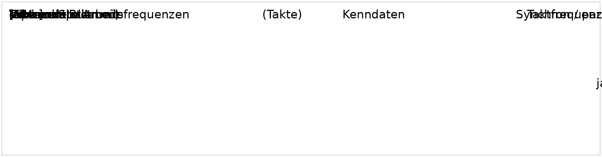
  </a>
  <figcaption>Figure <code>192_2_1</code> · BT-LAH-EMV-192 — <a href="../../docs/public/assets/BT-LAH-Modul_EMV_Lenkhilfe_2.5_EXERPT_20160509/192_2_1.png" target="_blank" rel="noopener">open full size</a>  Embedded source: <a href="../../docs/public/assets/BT-LAH-Modul_EMV_Lenkhilfe_2.5_EXERPT_20160509/192_2_1.bin" download>source <code>192_2_1.bin</code></a></figcaption>
</figure>

Transcription (English, machine-translated — searchable text)

Characteristics Characteristics Working frequencies used(acti) [MHz] Bar Modulation yes/no (Spread Spectrum) Microcontroller with synchronous / parallel / serial external bus mode clock frequency f [MHz] =

| | |
|---|---|
| Validity | valid (DE: gültig) |
| Status VW | to evaluate |
| Status supplier | agreed |

#### ***8.1.2.3 PCB properties***

<code>BT-LAH-EMV-260</code> <code>Überschrift</code> · heading valid VW: not to evaluate Supplier: agreed — <strong><strong>*8.1.2.3 PCB properties</strong>*</strong>

| | |
|---|---|
| Validity | valid (DE: gültig) |
| Status VW | not to evaluate |
| Status supplier | agreed |

<code>BT-LAH-EMV-277</code> <code>Anforderung</code> · requirement valid VW: to evaluate Supplier: agreed

The contractor must create and submit a graphical illustration with written description and a table listing the layer structure and layer sequence with their corresponding functions.

| | |
|---|---|
| Validity | valid (DE: gültig) |
| Status VW | to evaluate |
| Status supplier | agreed |

<code>BT-LAH-EMV-279</code> <code>Anforderung</code> · requirement valid VW: to evaluate Supplier: agreed

The contractor is to submit a graphical illustration and written description of the grounding and power supply plan. The contractor is to present a detailed description of various supply systems for analog, digital, and power circuits, including a graphical illustration of the decoupling between these partial circuits.

| | |
|---|---|
| Validity | valid (DE: gültig) |
| Status VW | to evaluate |
| Status supplier | agreed |

#### ***8.1.2.4 Shielding layout***

<code>BT-LAH-EMV-549</code> <code>Überschrift</code> · heading valid VW: not to evaluate Supplier: agreed — <strong><strong>*8.1.2.4 Shielding layout</strong>*</strong>

| | |
|---|---|
| Validity | valid (DE: gültig) |
| Status VW | not to evaluate |
| Status supplier | agreed |

<code>BT-LAH-EMV-550</code> <code>Anforderung</code> · requirement valid VW: to evaluate Supplier: agreed

The contractor is to submit or present in a suitable form a graphical illustration and written description of the shielding layout. The graphical illustration must contain a colored marking of the contacts between shielding and ground as well as a scaled colored illustration of all openings of the shielding. In addition, the filtering of all cables going through the shielding must be described.

| | |
|---|---|
| Validity | valid (DE: gültig) |
| Status VW | to evaluate |
| Status supplier | agreed |

### **8.2 EMC test plan**

<code>BT-LAH-EMV-1052</code> <code>Überschrift</code> · heading valid VW: not to evaluate Supplier: agreed — <strong><strong>8.2 EMC test plan</strong></strong>

| | |
|---|---|
| Validity | valid (DE: gültig) |
| Status VW | not to evaluate |
| Status supplier | agreed |

<code>BT-LAH-EMV-1053</code> <code>Anforderung</code> · requirement valid VW: to evaluate Supplier: agreed

Section i:
Cover sheet with precise specifications of the version (change history) and the component/system to be tested.

| | |
|---|---|
| Validity | valid (DE: gültig) |
| Status VW | to evaluate |
| Status supplier | agreed |

<code>BT-LAH-EMV-1054</code> <code>Anforderung</code> · requirement valid VW: to evaluate Supplier: agreed

Section ii:
Description of the DUT and its periphery including device interfaces and associated pin assignment.

| | |
|---|---|
| Validity | valid (DE: gültig) |
| Status VW | to evaluate |
| Status supplier | agreed |

<code>BT-LAH-EMV-1055</code> <code>Anforderung</code> · requirement valid VW: to evaluate Supplier: agreed

Section iii:
Indication of reasonable and necessary system statuses/functional statuses and plausibility check. Specification of the electronic control unit variants to be measured and the general test conditions.

| | |
|---|---|
| Validity | valid (DE: gültig) |
| Status VW | to evaluate |
| Status supplier | agreed |

<code>BT-LAH-EMV-1056</code> <code>Anforderung</code> · requirement valid VW: to evaluate Supplier: agreed

Section X:
Respective test as per pertinent TL, where X stands for the test method performed. Specification of the TL version to be used.

**X	Test/test method**

**1**Interference emission on supply cables

**2**Interference immunity of supply cable inputs

**3**Interference immunity of sensor cable inputs

**4**Conducted interference emission

**5**Radiated interference emission

**6**Radiated interference

**7**ESD (packaging and handling, direct and indirect system level)

**8**Test with respect to magnetic fields
(The placeholders "i" and "X" must be replaced with the corresponding section number.)

<figure class="req-figure" id="fig-1056_2_1">
  <a href="../../docs/public/assets/BT-LAH-Modul_EMV_Lenkhilfe_2.5_EXERPT_20160509/1056_2_1.png" target="_blank" rel="noopener">
    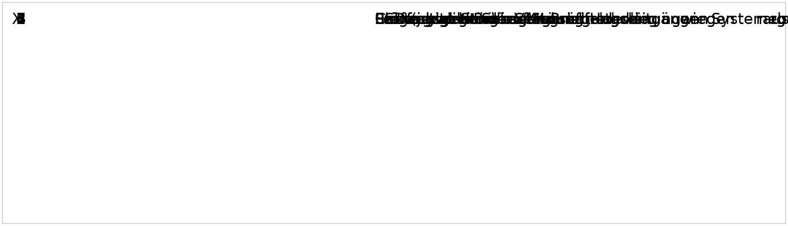
  </a>
  <figcaption>Figure <code>1056_2_1</code> · BT-LAH-EMV-1056 — <a href="../../docs/public/assets/BT-LAH-Modul_EMV_Lenkhilfe_2.5_EXERPT_20160509/1056_2_1.png" target="_blank" rel="noopener">open full size</a>  Embedded source: <a href="../../docs/public/assets/BT-LAH-Modul_EMV_Lenkhilfe_2.5_EXERPT_20160509/1056_2_1.bin" download>source <code>1056_2_1.bin</code></a></figcaption>
</figure>

Transcription (English, machine-translated — searchable text)

X Test / Test method 1 Disruption on supply lines 2 Immunity of supply line inputs 3 Immunity of sensor line inputs 4 Lined interference transmission 5 Radioactive emission 6 Irradiation 7 ESD (both packaging and handling as well as system level directly and indirectly) 8 Test against magnetic fields

| | |
|---|---|
| Validity | valid (DE: gültig) |
| Status VW | to evaluate |
| Status supplier | agreed |

<code>BT-LAH-EMV-1057</code> <code>Anforderung</code> · requirement valid VW: to evaluate Supplier: agreed

Section X.1:
Description of the measuring setup with detailed sketches and specification of the frequency range covered.

| | |
|---|---|
| Validity | valid (DE: gültig) |
| Status VW | to evaluate |
| Status supplier | agreed |

<code>BT-LAH-EMV-1058</code> <code>Anforderung</code> · requirement valid VW: to evaluate Supplier: agreed

Section X.2:
Description of the loads/system simulations to be used, as well as the test wiring harness and its cable length.

| | |
|---|---|
| Validity | valid (DE: gültig) |
| Status VW | to evaluate |
| Status supplier | agreed |

<code>BT-LAH-EMV-1059</code> <code>Anforderung</code> · requirement valid VW: to evaluate Supplier: agreed

Section X.3:
Indication of the limits/requirements to be complied with and the parameters to be set in the respective test.

| | |
|---|---|
| Validity | valid (DE: gültig) |
| Status VW | to evaluate |
| Status supplier | agreed |

<code>BT-LAH-EMV-1060</code> <code>Anforderung</code> · requirement valid VW: to evaluate Supplier: agreed

Section X.4:
Specification of the signals to be monitored and specified failure criteria during the measurement.

| | |
|---|---|
| Validity | valid (DE: gültig) |
| Status VW | to evaluate |
| Status supplier | agreed |

### **8.3 EMC qualification report**

<code>BT-LAH-EMV-742</code> <code>Überschrift</code> · heading valid VW: not to evaluate Supplier: agreed — <strong><strong>8.3 EMC qualification report</strong></strong>

| | |
|---|---|
| Validity | valid (DE: gültig) |
| Status VW | not to evaluate |
| Status supplier | agreed |

<code>BT-LAH-EMV-743</code> <code>Anforderung</code> · requirement valid VW: to evaluate Supplier: agreed

The qualification report must contain all items as described below. A suitable structure must be selected based on the following sample structure.

| | |
|---|---|
| Validity | valid (DE: gültig) |
| Status VW | to evaluate |
| Status supplier | agreed |

<code>BT-LAH-EMV-744</code> <code>Anforderung</code> · requirement valid VW: to evaluate Supplier: agreed

Section i:
Cover sheet (see "EMC Qualification Report" form at the end of this section)

| | |
|---|---|
| Validity | valid (DE: gültig) |
| Status VW | to evaluate |
| Status supplier | agreed |

<code>BT-LAH-EMV-745</code> <code>Anforderung</code> · requirement valid VW: to evaluate Supplier: agreed

Section ii:
Description of the DUT and its periphery (hardware/software versions, part numbers)

| | |
|---|---|
| Validity | valid (DE: gültig) |
| Status VW | to evaluate |
| Status supplier | agreed |

<code>BT-LAH-EMV-746</code> <code>Anforderung</code> · requirement valid VW: to evaluate Supplier: agreed

Section iii:
Description of the EMC status (EMC measures for the sample version)

| | |
|---|---|
| Validity | valid (DE: gültig) |
| Status VW | to evaluate |
| Status supplier | agreed |

<code>BT-LAH-EMV-747</code> <code>Anforderung</code> · requirement valid VW: to evaluate Supplier: agreed

Section X:
Respective test as per pertinent TL, where X stands for the test method performed.

**X	Test/test method**

**1**Interference emission on supply cables

**2**Interference immunity of supply cable inputs

**3**Interference immunity of sensor cable inputs

**4**Conducted interference emission

**5**Radiated interference emission

**6**Radiated interference

**7**ESD (packaging and handling, direct and indirect system level)

**8**Test with respect to magnetic fields
(The placeholders "i" and "X" must be replaced with the corresponding section number.)

<figure class="req-figure" id="fig-747_2_1">
  
  <figcaption>Figure <code>747_2_1</code> · BT-LAH-EMV-747 — <a href="../../docs/public/assets/BT-LAH-Modul_EMV_Lenkhilfe_2.5_EXERPT_20160509/747_2_1.png" target="_blank" rel="noopener">open full size</a>  Embedded source: <a href="../../docs/public/assets/BT-LAH-Modul_EMV_Lenkhilfe_2.5_EXERPT_20160509/747_2_1.bin" download>source <code>747_2_1.bin</code></a></figcaption>
</figure>

Transcription (English, machine-translated — searchable text)

X Test/Test method 1 Disruption on supply lines 2 Immunity of supply line inputs 3 Immunity of sensor line inputs 4 Lined interference transmission 5 Radioactive emission 6 Irradiation 7 ESD (both packaging and handling as well as system level directly and indirectly) 8 Test against magnetic fields

| | |
|---|---|
| Validity | valid (DE: gültig) |
| Status VW | to evaluate |
| Status supplier | agreed |

<code>BT-LAH-EMV-748</code> <code>Anforderung</code> · requirement valid VW: to evaluate Supplier: agreed

Section X.1:
Description of the measuring setup

| | |
|---|---|
| Validity | valid (DE: gültig) |
| Status VW | to evaluate |
| Status supplier | agreed |

<code>BT-LAH-EMV-749</code> <code>Anforderung</code> · requirement valid VW: to evaluate Supplier: agreed

Section X.2:
Description of the loads used for system simulation

| | |
|---|---|
| Validity | valid (DE: gültig) |
| Status VW | to evaluate |
| Status supplier | agreed |

<code>BT-LAH-EMV-750</code> <code>Anforderung</code> · requirement valid VW: to evaluate Supplier: agreed

Section X.3:
Suitable, sharp photographs of the setup

| | |
|---|---|
| Validity | valid (DE: gültig) |
| Status VW | to evaluate |
| Status supplier | agreed |

<code>BT-LAH-EMV-751</code> <code>Anforderung</code> · requirement valid VW: to evaluate Supplier: agreed

Section X.4:
Description of all measuring equipment used

| | |
|---|---|
| Validity | valid (DE: gültig) |
| Status VW | to evaluate |
| Status supplier | agreed |

<code>BT-LAH-EMV-753</code> <code>Anforderung</code> · requirement valid VW: to evaluate Supplier: agreed

Section X.5:
Description of the system/functional status settings for the respective test

| | |
|---|---|
| Validity | valid (DE: gültig) |
| Status VW | to evaluate |
| Status supplier | agreed |

<code>BT-LAH-EMV-755</code> <code>Anforderung</code> · requirement valid VW: to evaluate Supplier: agreed

Section X.6:
Results presented in a suitable format (e.g., diagrams subdivided into meaningful subsections with associated limit curves, presentation of the measuring equipment settings used, documentation of precise coupling points such as discharge points for ESD or the clamp position for the bulk current injection (BCI) test, etc.).

| | |
|---|---|
| Validity | valid (DE: gültig) |
| Status VW | to evaluate |
| Status supplier | agreed |

<code>BT-LAH-EMV-827</code> <code>Anforderung</code> · requirement valid VW: to evaluate Supplier: agreed

**EMC qualification report**
**EMC test/contractor**
**Documentation of EMC for:**
Electronic component:	____________________________________
System: 	____________________________________
Part number: 	____________________________________
Hardware version: 	____________________________________
Software version: 	____________________________________
Device number: 	____________________________________
Coordinator: 	____________________________________
Supplier/manufacturer: 	____________________________________

**EMC-R* sect.		Measurements to be carried out	Measurement result**

1	♦	Interference emission on supply cables

2	♦	Interference immunity of supply cable inputs

3	♦	Interference immunity of sensor cable inputs

4	♦	Interference emission

5	♦	Radiated interference

6	♦	ESD

7	♦	Interference immunity to magnetic fields

8	♦	Additional EMC requirements
* EMC-R: EMC requirements
**EMC development status:**
_____________________________________________________________________
_____________________________________________________________________
Coordinator:
Name:	______________________	Phone: _______________________
Department: ______________________	Fax: _______________________
E-mail: _______________________
_____________________________	___________________________
Date		Signature

<figure class="req-figure" id="fig-827_2_1">
  <a href="../../docs/public/assets/BT-LAH-Modul_EMV_Lenkhilfe_2.5_EXERPT_20160509/827_2_1.png" target="_blank" rel="noopener">
    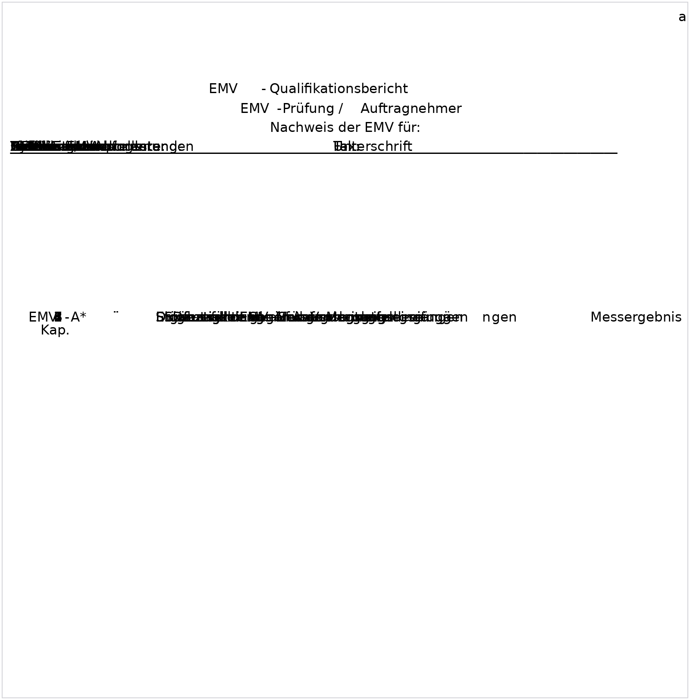
  </a>
  <figcaption>Figure <code>827_2_1</code> · BT-LAH-EMV-827 — <a href="../../docs/public/assets/BT-LAH-Modul_EMV_Lenkhilfe_2.5_EXERPT_20160509/827_2_1.png" target="_blank" rel="noopener">open full size</a>  Embedded source: <a href="../../docs/public/assets/BT-LAH-Modul_EMV_Lenkhilfe_2.5_EXERPT_20160509/827_2_1.bin" download>source <code>827_2_1.bin</code></a></figcaption>
</figure>

Transcription (English, machine-translated — searchable text)

a EMC qualification report EMC verification / contractor Proof of EMC for: Electronic component:________________________________________ System: ____________________________________________________________________________________________________________________________________________________________________________________________________________________________________________________________________________________________________________________________________________________________________________________________________________________________________________________________________________________________________________________________ Part number: ____________________________________ Hardware status: ___________________________________________________________________________________________________________________________________________________________________________________________________________________________________________________________________________________________________________________________________________________________________________________________________________________________________________________________________________________________________________________________ Software status: ________________________________________ Device number: ________________________________________ Subject person: _________________________________________ Supplier/Manufacturer: _________________________________________________________________________________________________________________________________________________________________________________________________________________________________________________________________________________________________________________________________________________________________________________________________________________________________________________________________________________________________________________________ EMC-A* Measurements to be carried out Measurement result Cape. 1 ̈ Disruption on supply lines 2 ̈ Immunity of supply line inputs 3 ̈ Immunity of sensor line inputs 4 ̈ Disruption 5.Immunity emitted 6–ESD 7 ̈ Immunity to magnetic fields 8.Complementary EMC requirements * EMC-A: EMC requirements EMC development status: ______________________________________________________________________________________________________________________________________________________________________________________________________________________________________________________________________________________________________________________________________________________________________________________________________________________________________________________________________________________________________________________________ ______________________________________________________________________________________________________________________________________________________________________________________________________________________________________________________________________________________________________________________________________________________________________________________________________________________________________________________________________________________________________________________________ Operator: Name:____________________________________________________________________________________________________________________________________________________________________________________________________________________________________________________________________________________________________________________________________________________________________________________________________________________________________________________________________________________________________________________________ Department: ____________________________________________________________________________________________________________________________________________________________________________________________________________________________________________________________________________________________________________________________________________________________________________________________________________________________________________________________________________________________________________________________ E-mail: ______________________ ______________________________________________________________ Date Signature

| | |
|---|---|
| Validity | valid (DE: gültig) |
| Status VW | to evaluate |
| Status supplier | agreed |

---
*Source RIF `BT-LAH-Modul_EMV_Lenkhilfe_2.5_EXERPT_20160509.xml` (2016-05-17T12:18:38+02:00). Embedded OLE objects (Word/Excel/Paint) are embedded as PNG (bitmap DIBs 1:1, vector WMF re-rendered + transcribed); originals linked per figure. English: official DOORS text where available, otherwise machine-translated (Helsinki-NLP/opus-mt-de-en + automotive glossary), marked per requirement.*