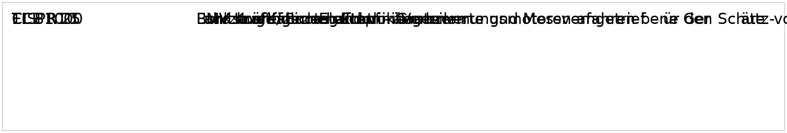

# Component Spec — iLWS

:::note
Default language is **English**. Official DOORS English is used where present (88/88 objects); the remaining 0 objects carry a yellow **MT** badge (machine-translated from German with Helsinki-NLP/opus-mt-de-en + automotive glossary; type `MT` in the filter box to list them). Use the language switcher for the full German edition.
:::

| Metric | Value |
|---|---|
| Objekte / objects | 88 |
| Anforderungen / requirements | 62 |
| Informationen / information | 5 |
| TBD | 0 |
| Überschriften / headings | 21 |
| Abbildungen / figures | 1 |
| Official EN text | 88 (100%) |
| Machine-translated EN | 0 |

  <input id="req-q" type="search" placeholder="Filter by ID or text…" aria-label="Filter requirements" />
  <select id="req-t" aria-label="Filter by type">
    <option value="">Type: all</option>
    <option value="Anforderung">Anforderung · requirement</option>
    <option value="Information">Information · information</option>
    <option value="TBD">TBD · TBD</option>
    <option value="Überschrift">Überschrift · heading</option>
  </select>
  

## Steering Angle Sensing

<code>iLWS-95</code> <code>Überschrift</code> · heading valid VW: not to evaluate Supplier: agreed — <strong>Steering Angle Sensing</strong>

| | |
|---|---|
| Validity | valid (DE: gültig) |
| Status VW | not to evaluate |
| Status supplier | agreed |

### General information

<code>iLWS-43</code> <code>Überschrift</code> · heading valid VW: accepted Supplier: agreed — <strong>General information</strong>

| | |
|---|---|
| Validity | valid (DE: gültig) |
| Status VW | accepted |
| Status supplier | agreed |

<code>iLWS-700</code> <code>Information</code> · information valid VW: accepted Supplier: agreed

This module specifies the requirements set forth by the purchaser for the steering angle sensing of the EPS. It is mandatory for the development of the components involved.

This module is part of the Steering System Performance Specifications and is only valid together with it.

| | |
|---|---|
| Validity | valid (DE: gültig) |
| Status VW | accepted |
| Status supplier | agreed |

<code>iLWS-712</code> <code>Anforderung</code> · requirement valid VW: accepted Supplier: agreed

The steering angle described in these Performance Specifications is relative to the steering pinion (the torsion bar is not taken into consideration).

| | |
|---|---|
| Validity | valid (DE: gültig) |
| Status VW | accepted |
| Status supplier | agreed |

<code>iLWS-713</code> <code>Anforderung</code> · requirement valid VW: accepted Supplier: agreed

For steering systems with a variable or non-fixed steering ratio, a virtual steering angle must also be prepared that is proportional to the rack travel.

| | |
|---|---|
| Validity | valid (DE: gültig) |
| Status VW | accepted |
| Status supplier | agreed |

### Project requirements

<code>iLWS-775</code> <code>Überschrift</code> · heading valid VW: accepted Supplier: agreed — <strong>Project requirements</strong>

| | |
|---|---|
| Validity | valid (DE: gültig) |
| Status VW | accepted |
| Status supplier | agreed |

<code>iLWS-786</code> <code>Anforderung</code> · requirement valid VW: accepted Supplier: agreed

A signal path documentation must be prepared and submitted for the steering angle signal. The signal path documentation must include at least the following information:
Description of the active chain
Description of the sensor system design (functional principle, mechanical design, block circuit diagram including a designation of the sensor elements used including data sheet, manufacturing solution, calibration, characteristic curve, filtering)
Description of the interface between sensor system and control module (voltage supply and voltage level (characteristics during normal operation, under/overvoltage), description of the data protocol, data protocol content (run-up, normal operation, fault case), sampling rate
Signal processing (processing, filtering, monitoring) in the control module including a description of the dependencies on operating states (run-up, normal operation, under/overvoltage, fault case)
Signal transit times (physical variables at the steering system input shaft up to the bus output) during normal operation and in case of faults
Safety strategy and information on availability
Description of the developer signals

| | |
|---|---|
| Validity | valid (DE: gültig) |
| Status VW | accepted |
| Status supplier | agreed |

Comments

<strong>Nexteer:</strong> Zu welchem Meilenstein muss Doku verfügbar sein?

<code>iLWS-787</code> <code>Anforderung</code> · requirement valid VW: accepted Supplier: agreed

A tolerance computation must be prepared and submitted for the steering angle signal.

The tolerance computation refers to the steering angle at the output shaft and the steering torque information output as a bus signal. The tolerance computation must break down all tolerances and represent these jointly for:

- New parts at room temperature
- New parts in the operating temperature range
- Service life in the operating temperature range

Details of the tolerance computation including the data on which the computation is based (data sheet, simulations, PPAP documents, etc.) must be disclosed to the purchaser.

| | |
|---|---|
| Validity | valid (DE: gültig) |
| Status VW | accepted |
| Status supplier | agreed |

<code>iLWS-788</code> <code>Anforderung</code> · requirement valid VW: accepted Supplier: agreed

The reliability testing reports for the tests described in the "Reliability testing" section must be made available to the purchaser.

| | |
|---|---|
| Validity | valid (DE: gültig) |
| Status VW | accepted |
| Status supplier | agreed |

<code>iLWS-789</code> <code>Anforderung</code> · requirement valid VW: accepted Supplier: agreed

The safety strategy must be documented by the development partner and agreed with the purchaser.

| | |
|---|---|
| Validity | valid (DE: gültig) |
| Status VW | accepted |
| Status supplier | agreed |

### Product requirements

<code>iLWS-776</code> <code>Überschrift</code> · heading valid VW: accepted Supplier: agreed — <strong>Product requirements</strong>

| | |
|---|---|
| Validity | valid (DE: gültig) |
| Status VW | accepted |
| Status supplier | agreed |

#### Technical requirements

<code>iLWS-778</code> <code>Überschrift</code> · heading valid VW: accepted Supplier: agreed — <strong>Technical requirements</strong>

| | |
|---|---|
| Validity | valid (DE: gültig) |
| Status VW | accepted |
| Status supplier | agreed |

#### Boundary conditions for the design

<code>iLWS-790</code> <code>Überschrift</code> · heading valid VW: accepted Supplier: agreed — <strong>Boundary conditions for the design</strong>

| | |
|---|---|
| Validity | valid (DE: gültig) |
| Status VW | accepted |
| Status supplier | agreed |

<code>iLWS-698</code> <code>Anforderung</code> · requirement valid VW: accepted Supplier: agreed

All angle specifications are defined exclusive of the influence of the torsion bar; the performance values and the output on the communication bus refer to the output shaft.

| | |
|---|---|
| Validity | valid (DE: gültig) |
| Status VW | accepted |
| Status supplier | agreed |

Comments

<strong>Nexteer:</strong> Sensorik an der Ausgangswelle

<code>iLWS-641</code> <code>Anforderung</code> · requirement valid VW: accepted Supplier: agreed

The quiescent current draw by the steering angle information feature must not exceed a maximum of 0.1 mA.
The maximum quiescent current draw of the overall system must only increase if signal monitoring in sleep mode is technically required.

| | |
|---|---|
| Validity | valid (DE: gültig) |
| Status VW | accepted |
| Status supplier | agreed |

<code>iLWS-643</code> <code>Anforderung</code> · requirement valid VW: accepted Supplier: agreed

The measuring range of the steering angle must be at least +/-1 040°.

| | |
|---|---|
| Validity | valid (DE: gültig) |
| Status VW | accepted |
| Status supplier | agreed |

Comments

<strong>Nexteer:</strong> sihnal range is +- 900° , mechanical range is inlimited

<code>iLWS-105</code> <code>Anforderung</code> · requirement valid VW: accepted Supplier: agreed

The required sensors must be non-contacting, non-wearing, and non-interacting. That is, they must operate without additional friction.

| | |
|---|---|
| Validity | valid (DE: gültig) |
| Status VW | accepted |
| Status supplier | agreed |

<code>iLWS-321</code> <code>Information</code> · information valid VW: accepted Supplier: agreed

Sensor cables and plug-in connections must preferably be contained within the steering housing.

| | |
|---|---|
| Validity | valid (DE: gültig) |
| Status VW | accepted |
| Status supplier | agreed |

<code>iLWS-257</code> <code>Anforderung</code> · requirement valid VW: accepted Supplier: agreed

If the cables are routed externally, the data necessary for generating the angle signal must be transmitted digitally.

| | |
|---|---|
| Validity | valid (DE: gültig) |
| Status VW | accepted |
| Status supplier | agreed |

<code>iLWS-293</code> <code>Anforderung</code> · requirement valid VW: accepted Supplier: agreed

The fault-free generation of the steering angle signals and their output on the communication bus must not be lost, even if the steering support is faulty or switched off.

| | |
|---|---|
| Validity | valid (DE: gültig) |
| Status VW | accepted |
| Status supplier | agreed |

Comments

<strong>Nexteer:</strong> N/A

<code>iLWS-120</code> <code>Anforderung</code> · requirement valid VW: accepted Supplier: agreed

It must be taken into consideration that an external steering angle sensor will be used in vehicles that have electrical power-assisted steering. It must therefore be possible to switch off the output of the steering angle.

| | |
|---|---|
| Validity | valid (DE: gültig) |
| Status VW | accepted |
| Status supplier | agreed |

Comments

<strong>Nexteer:</strong> N/A

#### Sensor performance

<code>iLWS-791</code> <code>Überschrift</code> · heading valid VW: accepted Supplier: agreed — <strong>Sensor performance</strong>

| | |
|---|---|
| Validity | valid (DE: gültig) |
| Status VW | accepted |
| Status supplier | agreed |

<code>iLWS-645</code> <code>Anforderung</code> · requirement valid VW: accepted Supplier: agreed

The sensor resolution must be at least 0,1°.

| | |
|---|---|
| Validity | valid (DE: gültig) |
| Status VW | accepted |
| Status supplier | agreed |

Comments

<strong>Nexteer:</strong> Sensor HW Auflösung= 0.012°

<code>iLWS-652</code> <code>Anforderung</code> · requirement valid VW: accepted Supplier: agreed

The maximum total error of the steering angle signal must be +/-2,25°.

| | |
|---|---|
| Validity | valid (DE: gültig) |
| Status VW | accepted |
| Status supplier | agreed |

Comments

<strong>Nexteer:</strong> Defintion of error. reference value need to be defined

<code>iLWS-650</code> <code>Anforderung</code> · requirement valid VW: accepted Supplier: agreed

The maximum hysteresis must not exceed +/-1,5°.

| | |
|---|---|
| Validity | valid (DE: gültig) |
| Status VW | accepted |
| Status supplier | agreed |

<code>iLWS-653</code> <code>Anforderung</code> · requirement valid VW: accepted Supplier: agreed

The friction torque of the sensor system must be less than 0,05 Nm.

| | |
|---|---|
| Validity | valid (DE: gültig) |
| Status VW | accepted |
| Status supplier | agreed |

<code>iLWS-647</code> <code>Anforderung</code> · requirement valid VW: accepted Supplier: agreed

The maximum error of the steering angle speed is 20°/s.

| | |
|---|---|
| Validity | valid (DE: gültig) |
| Status VW | accepted |
| Status supplier | agreed |

<code>iLWS-649</code> <code>Anforderung</code> · requirement valid VW: to evaluate Supplier: agreed

Therms_noise must be less than or equal to ±0,2 Nm.

| | |
|---|---|
| Validity | valid (DE: gültig) |
| Status VW | to evaluate |
| Status supplier | agreed |

#### Safety requirements

<code>iLWS-779</code> <code>Überschrift</code> · heading valid VW: accepted Supplier: agreed — <strong>Safety requirements</strong>

| | |
|---|---|
| Validity | valid (DE: gültig) |
| Status VW | accepted |
| Status supplier | agreed |

<code>iLWS-171</code> <code>Anforderung</code> · requirement valid VW: accepted Supplier: agreed

An ASIL-D signal (starting with the first bus message) of the steering angle must be present in the steering system software and output on the communication bus.

| | |
|---|---|
| Validity | valid (DE: gültig) |
| Status VW | accepted |
| Status supplier | agreed |

<code>iLWS-106</code> <code>Anforderung</code> · requirement valid VW: accepted Supplier: agreed

The sensor system's probability of failure (with control module input circuitry) must not exceed 100 FIT

| | |
|---|---|
| Validity | valid (DE: gültig) |
| Status VW | accepted |
| Status supplier | agreed |

<code>iLWS-793</code> <code>Anforderung</code> · requirement valid VW: accepted Supplier: agreed

The safety limits at which a faulty signal must be detected are as follows:
+/-5° deviation from the actual angle value with a fault tolerance period of 300 ms
+/-10° deviation from the actual angle value with a fault tolerance period of 100 ms
+/-15° deviation from the actual angle value with a fault tolerance period of 20 ms

| | |
|---|---|
| Validity | valid (DE: gültig) |
| Status VW | accepted |
| Status supplier | agreed |

<code>iLWS-811</code> <code>Anforderung</code> · requirement valid VW: accepted Supplier: agreed

A faulty signal must be signaled on the communication bus. The qualifier bit (Q-bit) must be used for this as per the Group Performance Specification for CAN.

| | |
|---|---|
| Validity | valid (DE: gültig) |
| Status VW | accepted |
| Status supplier | agreed |

<code>iLWS-794</code> <code>Anforderung</code> · requirement valid VW: accepted Supplier: agreed

All sensor errors must be diagnosed on occurrence.

| | |
|---|---|
| Validity | valid (DE: gültig) |
| Status VW | accepted |
| Status supplier | agreed |

#### Bus output

<code>iLWS-780</code> <code>Überschrift</code> · heading valid VW: accepted Supplier: agreed — <strong>Bus output</strong>

| | |
|---|---|
| Validity | valid (DE: gültig) |
| Status VW | accepted |
| Status supplier | agreed |

<code>iLWS-133</code> <code>Anforderung</code> · requirement valid VW: accepted Supplier: agreed

The maximum signal age of signals output on the CAN is 5 ms.

| | |
|---|---|
| Validity | valid (DE: gültig) |
| Status VW | accepted |
| Status supplier | agreed |

<code>iLWS-703</code> <code>Anforderung</code> · requirement valid VW: accepted Supplier: agreed

The steering angle information must be valid with the first transmitted message and correspond to the measured value.

| | |
|---|---|
| Validity | valid (DE: gültig) |
| Status VW | accepted |
| Status supplier | agreed |

Comments

<strong>Nexteer:</strong> need to define entire initialization time

<code>iLWS-117</code> <code>Anforderung</code> · requirement valid VW: accepted Supplier: agreed

The steering-wheel angular velocity must also be output in the uncalibrated and uninitialized state (see section 2.9, "Computation of the steering-wheel angular velocity"

| | |
|---|---|
| Validity | valid (DE: gültig) |
| Status VW | accepted |
| Status supplier | agreed |

<code>iLWS-646</code> <code>Anforderung</code> · requirement valid VW: accepted Supplier: agreed

The maximum steering angle speed that is output on the communication bus is +/-3 000°/s. Angular speeds greater than this value are limited to 3 000°/s on the bus.

| | |
|---|---|
| Validity | valid (DE: gültig) |
| Status VW | accepted |
| Status supplier | agreed |

<code>iLWS-212</code> <code>Anforderung</code> · requirement valid VW: accepted Supplier: agreed

The calibration occurs exclusively via the diagnosis address of the electrical power-assisted steering.

| | |
|---|---|
| Validity | valid (DE: gültig) |
| Status VW | accepted |
| Status supplier | agreed |

#### Formatting of the steering angle 1 message

<code>iLWS-223</code> <code>Überschrift</code> · heading valid VW: accepted Supplier: agreed — <strong>Formatting of the steering angle 1 message</strong>

| | |
|---|---|
| Validity | valid (DE: gültig) |
| Status VW | accepted |
| Status supplier | agreed |

<code>iLWS-575</code> <code>Information</code> · information valid VW: accepted Supplier: agreed

The CAN message LWI_01 is described in the CAN interface messages module.

| | |
|---|---|
| Validity | valid (DE: gültig) |
| Status VW | accepted |
| Status supplier | agreed |

#### Steering angle information status on CAN

<code>iLWS-690</code> <code>Überschrift</code> · heading valid VW: accepted Supplier: agreed — <strong>Steering angle information status on CAN</strong>

| | |
|---|---|
| Validity | valid (DE: gültig) |
| Status VW | accepted |
| Status supplier | agreed |

<code>iLWS-691</code> <code>Anforderung</code> · requirement valid VW: accepted Supplier: agreed

The status information of the steering angle information on the CAN must be handled (during active output of the message).

| | |
|---|---|
| Validity | valid (DE: gültig) |
| Status VW | accepted |
| Status supplier | agreed |

#### Development message

<code>iLWS-226</code> <code>Überschrift</code> · heading valid VW: accepted Supplier: agreed — <strong>Development message</strong>

| | |
|---|---|
| Validity | valid (DE: gültig) |
| Status VW | accepted |
| Status supplier | agreed |

<code>iLWS-574</code> <code>Anforderung</code> · requirement valid VW: accepted Supplier: agreed

Information regarding the steering angle sensor that is relevant for development must be output.

| | |
|---|---|
| Validity | valid (DE: gültig) |
| Status VW | accepted |
| Status supplier | agreed |

<code>iLWS-576</code> <code>Information</code> · information valid VW: accepted Supplier: agreed

The output occurs via development messages that are defined in the CAN interface messages module.

| | |
|---|---|
| Validity | valid (DE: gültig) |
| Status VW | accepted |
| Status supplier | agreed |

<code>iLWS-578</code> <code>Anforderung</code> · requirement valid VW: accepted Supplier: agreed

Other signals can be added during the development phase. A reserve must be planned for.

| | |
|---|---|
| Validity | valid (DE: gültig) |
| Status VW | accepted |
| Status supplier | agreed |

<code>iLWS-577</code> <code>Anforderung</code> · requirement valid VW: accepted Supplier: agreed

The output of further signals at the request of the contractor must be agreed with the purchaser.

| | |
|---|---|
| Validity | valid (DE: gültig) |
| Status VW | accepted |
| Status supplier | agreed |

#### Implementation specifications

<code>iLWS-781</code> <code>Überschrift</code> · heading valid VW: accepted Supplier: agreed — <strong>Implementation specifications</strong>

| | |
|---|---|
| Validity | valid (DE: gültig) |
| Status VW | accepted |
| Status supplier | agreed |

#### Fault handling

<code>iLWS-782</code> <code>Überschrift</code> · heading valid VW: accepted Supplier: agreed — <strong>Fault handling</strong>

| | |
|---|---|
| Validity | valid (DE: gültig) |
| Status VW | accepted |
| Status supplier | agreed |

<code>iLWS-123</code> <code>Anforderung</code> · requirement valid VW: accepted Supplier: agreed

The system components and functions of the steering system that are involved in generating the steering angle sensor information must be integrated into the diagnosis of the electrical power-assisted steering, and it must be possible to call them using the same diagnosis address (address 44).

| | |
|---|---|
| Validity | valid (DE: gültig) |
| Status VW | accepted |
| Status supplier | agreed |

#### Software data specification

<code>iLWS-783</code> <code>Überschrift</code> · heading invalid VW: accepted Supplier: agreed — <strong>Software data specification</strong>

| | |
|---|---|
| Validity | invalid (DE: ungültig) |
| Status VW | accepted |
| Status supplier | agreed |

#### Computation of the steering wheel angular velocity

<code>iLWS-610</code> <code>Überschrift</code> · heading valid VW: accepted Supplier: agreed — <strong>Computation of the steering wheel angular velocity</strong>

| | |
|---|---|
| Validity | valid (DE: gültig) |
| Status VW | accepted |
| Status supplier | agreed |

<code>iLWS-611</code> <code>Anforderung</code> · requirement valid VW: accepted Supplier: agreed

Every 5 ms ±10%, the angle data must be read and stored in a FIFO buffer with 20 elements.

| | |
|---|---|
| Validity | valid (DE: gültig) |
| Status VW | accepted |
| Status supplier | agreed |

<code>iLWS-616</code> <code>Anforderung</code> · requirement valid VW: accepted Supplier: agreed

The mean value of the contents of the circular buffer provides the steering wheel angular velocity that is output in the unit °/s in the CAN message (as per CAN
database).

| | |
|---|---|
| Validity | valid (DE: gültig) |
| Status VW | accepted |
| Status supplier | agreed |

<code>iLWS-617</code> <code>Anforderung</code> · requirement valid VW: accepted Supplier: agreed

The steering wheel angular velocity is signed.

| | |
|---|---|
| Validity | valid (DE: gültig) |
| Status VW | accepted |
| Status supplier | agreed |

<code>iLWS-618</code> <code>Anforderung</code> · requirement valid VW: accepted Supplier: agreed

With a turn to the right (in a clockwise direction) the sign is negative.
(See ISO 8855)

| | |
|---|---|
| Validity | valid (DE: gültig) |
| Status VW | accepted |
| Status supplier | agreed |

<code>iLWS-619</code> <code>Anforderung</code> · requirement valid VW: accepted Supplier: agreed

With a turn to the left, the sign is positive.
(See ISO 8855)

| | |
|---|---|
| Validity | valid (DE: gültig) |
| Status VW | accepted |
| Status supplier | agreed |

<code>iLWS-620</code> <code>Anforderung</code> · requirement valid VW: accepted Supplier: agreed

With a change in direction, the circular buffer is emptied. This means that the angular speed is set to 0 °/s.

| | |
|---|---|
| Validity | valid (DE: gültig) |
| Status VW | accepted |
| Status supplier | agreed |

<code>iLWS-759</code> <code>Anforderung</code> · requirement valid VW: accepted Supplier: agreed

Without steering wheel angular velocity, the output steering wheel angular velocity must be zero.

| | |
|---|---|
| Validity | valid (DE: gültig) |
| Status VW | accepted |
| Status supplier | agreed |

<code>iLWS-622</code> <code>Information</code> · information valid VW: accepted Supplier: agreed

The max. steering-angle speed is 3 000°/s.

| | |
|---|---|
| Validity | valid (DE: gültig) |
| Status VW | accepted |
| Status supplier | agreed |

<code>iLWS-621</code> <code>Anforderung</code> · requirement valid VW: accepted Supplier: agreed

The steering-angle speed must also be output in the non-initialized state provided that no fault conditions are present.

| | |
|---|---|
| Validity | valid (DE: gültig) |
| Status VW | accepted |
| Status supplier | agreed |

#### Calibration specification

<code>iLWS-784</code> <code>Überschrift</code> · heading valid VW: accepted Supplier: agreed — <strong>Calibration specification</strong>

| | |
|---|---|
| Validity | valid (DE: gültig) |
| Status VW | accepted |
| Status supplier | agreed |

<code>iLWS-798</code> <code>Anforderung</code> · requirement valid VW: accepted Supplier: agreed

The steering angle must be able to be calibrated by means of diagnostic routines.

| | |
|---|---|
| Validity | valid (DE: gültig) |
| Status VW | accepted |
| Status supplier | agreed |

<code>iLWS-799</code> <code>Anforderung</code> · requirement valid VW: accepted Supplier: agreed

There must be two ways to calibrate the steering angle:
1. Passing the current steering angle
(See the "Steering-angle sensor, zero-point alignment with steering wheel balance" routine)
2. Setting the current angle as the zero position
(See the "Steering-angle sensor" routine)

| | |
|---|---|
| Validity | valid (DE: gültig) |
| Status VW | accepted |
| Status supplier | agreed |

<code>iLWS-800</code> <code>Anforderung</code> · requirement valid VW: accepted Supplier: agreed

The steering angle must be able to be calibrated without any other requirements. Alternately (at the supplier's request), the calibration sequence can be expanded to include turning the steering wheel past the steering center point (±10°) from +45° to -45° (initialization – this can occur either before or after the calibration command is issued).
(See the "Steering-angle sensor, initialization" routine)

| | |
|---|---|
| Validity | valid (DE: gültig) |
| Status VW | accepted |
| Status supplier | agreed |

<code>iLWS-801</code> <code>Anforderung</code> · requirement valid VW: accepted Supplier: agreed

The steering-angle calibration must not be skipped, except in case of the following events:
- A new, successful calibration
- The steering system was installed in another vehicle
- Actively cleared by the "Reset to factory settings" diagnostic routine

| | |
|---|---|
| Validity | valid (DE: gültig) |
| Status VW | accepted |
| Status supplier | agreed |

<code>iLWS-802</code> <code>Anforderung</code> · requirement valid VW: to evaluate Supplier: to clarify

Reinitialization must be reestablished after the "voltage loss at terminal 30" without a diagnostic routine. This must require a maximum of one steering motion of ±15° around the previously calibrated center position or a vehicle speed of 10 km/h for 15 s.

| | |
|---|---|
| Validity | valid (DE: gültig) |
| Status VW | to evaluate |
| Status supplier | to clarify |

Comments

<strong>Nexteer:</strong> Nexteer needs combination of HW torque

<code>iLWS-803</code> <code>Anforderung</code> · requirement valid VW: accepted Supplier: agreed

After sending the calibration command via the steering system's internal diagnostics, the sensor status changes from "uncalibrated" to "OK" at a delay of 100 ms once the calibration has completed successfully.

| | |
|---|---|
| Validity | valid (DE: gültig) |
| Status VW | accepted |
| Status supplier | agreed |

<code>iLWS-804</code> <code>Anforderung</code> · requirement valid VW: accepted Supplier: agreed

The calibration command must also be able to be executed on a steering system that has already been calibrated.

| | |
|---|---|
| Validity | valid (DE: gültig) |
| Status VW | accepted |
| Status supplier | agreed |

<code>iLWS-805</code> <code>Anforderung</code> · requirement valid VW: accepted Supplier: agreed

A steering system that has already been calibrated indicates the successful recalibration by switching from the "OK" status to "Uncalibrated" after the calibration command is sent, and then indicating the "OK" status after 100 ms.

| | |
|---|---|
| Validity | valid (DE: gültig) |
| Status VW | accepted |
| Status supplier | agreed |

<code>iLWS-806</code> <code>Anforderung</code> · requirement valid VW: accepted Supplier: agreed

The old calibration value is only discarded once the new value has been successfully applied.

| | |
|---|---|
| Validity | valid (DE: gültig) |
| Status VW | accepted |
| Status supplier | agreed |

<code>iLWS-807</code> <code>Anforderung</code> · requirement valid VW: accepted Supplier: agreed

Lack of calibration or initialization must be signaled by the malfunction indicator light, CAN signals, and event memory entry as per the method specified in the system fault handling.

| | |
|---|---|
| Validity | valid (DE: gültig) |
| Status VW | accepted |
| Status supplier | agreed |

<code>iLWS-808</code> <code>Anforderung</code> · requirement valid VW: accepted Supplier: agreed

The event memory entry must not be able to be deleted as long as the fault is active or it must be entered again immediately for faults that are still present.

| | |
|---|---|
| Validity | valid (DE: gültig) |
| Status VW | accepted |
| Status supplier | agreed |

<code>iLWS-809</code> <code>Anforderung</code> · requirement valid VW: accepted Supplier: agreed

Using the fault symptom number, the event memory entry must provide details pointing to the reason for the lack of calibration/initialization (initial setup, hardware fault, software error, monitoring measure, etc.).

| | |
|---|---|
| Validity | valid (DE: gültig) |
| Status VW | accepted |
| Status supplier | agreed |

### Testing requirements

<code>iLWS-777</code> <code>Überschrift</code> · heading valid VW: accepted Supplier: agreed — <strong>Testing requirements</strong>

| | |
|---|---|
| Validity | valid (DE: gültig) |
| Status VW | accepted |
| Status supplier | agreed |

#### Performance validation

<code>iLWS-162</code> <code>Überschrift</code> · heading valid VW: accepted Supplier: agreed — <strong>Performance validation</strong>

| | |
|---|---|
| Validity | valid (DE: gültig) |
| Status VW | accepted |
| Status supplier | agreed |

<code>iLWS-814</code> <code>Anforderung</code> · requirement valid VW: accepted Supplier: agreed

The results of the tolerance stack-up analysis for the "maximum deviation of the new part at room temperature" must be validated for each sample part by means of appropriate measurements.

| | |
|---|---|
| Validity | valid (DE: gültig) |
| Status VW | accepted |
| Status supplier | agreed |

<code>iLWS-815</code> <code>Anforderung</code> · requirement valid VW: accepted Supplier: agreed

The results of the tolerance stack-up analysis for the "maximum deviation of the new part at the operating temperature" must be validated for each sample version by means of appropriate measurements on a sufficiently large random sample.

| | |
|---|---|
| Validity | valid (DE: gültig) |
| Status VW | accepted |
| Status supplier | agreed |

<code>iLWS-816</code> <code>Anforderung</code> · requirement valid VW: accepted Supplier: agreed

The results of the tolerance stack-up analysis for the "maximum deviation over the service life in the operating temperature range" must be validated by means of appropriate comparative measurements (before and after the test) performed on design validation and process validation parts.

| | |
|---|---|
| Validity | valid (DE: gültig) |
| Status VW | accepted |
| Status supplier | agreed |

<code>iLWS-817</code> <code>Anforderung</code> · requirement valid VW: accepted Supplier: agreed

The results of the tolerance stack-up analysis for the "maximum deviation over the service life in the operating temperature range" must be validated by means of appropriate comparative measurements (before and after durability road testing) performed on selected durability road testing parts.

| | |
|---|---|
| Validity | valid (DE: gültig) |
| Status VW | accepted |
| Status supplier | agreed |

#### Environmental testing

<code>iLWS-161</code> <code>Überschrift</code> · heading valid VW: accepted Supplier: agreed — <strong>Environmental testing</strong>

| | |
|---|---|
| Validity | valid (DE: gültig) |
| Status VW | accepted |
| Status supplier | agreed |

<code>iLWS-163</code> <code>Anforderung</code> · requirement valid VW: accepted Supplier: agreed

The sensor proportion that is not tested with the control module must be tested separately as per VW 80000. The boundary conditions of the Component Performance Specification module "Electric and Electronic System Reliability Testing" apply.

Deviating from the specifications, the test voltages for the sensor supply must be adjusted: e.g., VDD = 5 V nominally.
Operating voltage range = 4,5 V to 5,5 V

| | |
|---|---|
| Validity | valid (DE: gültig) |
| Status VW | accepted |
| Status supplier | agreed |

<code>iLWS-164</code> <code>Anforderung</code> · requirement valid VW: accepted Supplier: agreed

The following requirements apply in addition to VW 80000:

The DUTs must be completely characterized/measured before and after the test.
The sensor performance of the DUTs must be monitored during the test.
 The specified dimensional and functional tolerances must be complied with.

| | |
|---|---|
| Validity | valid (DE: gültig) |
| Status VW | accepted |
| Status supplier | agreed |

#### Electromagnetic compatibility

<code>iLWS-795</code> <code>Überschrift</code> · heading valid VW: accepted Supplier: agreed — <strong>Electromagnetic compatibility</strong>

| | |
|---|---|
| Validity | valid (DE: gültig) |
| Status VW | accepted |
| Status supplier | agreed |

<code>iLWS-796</code> <code>Anforderung</code> · requirement valid VW: accepted Supplier: agreed

The sensor proportion that is not tested with the control module must be tested separately as per:

 TL 81000	Electromagnetic Compatibility of Automotive Electronic Components

ECE R10		Electromagnetic Compatibility vehicle guidance

Cispr 25		Cispr 25

The boundary conditions of the "Electromagnetic Compatibility" module of the Component Performance Specification apply.

<figure class="req-figure" id="fig-796_2_1">
  
  <figcaption>Figure <code>796_2_1</code> · iLWS-796 — <a href="../../docs/public/assets/LAH-iLWS_EXERPT_20160509/796_2_1.png" target="_blank" rel="noopener">open full size</a>  Embedded source: <a href="../../docs/public/assets/LAH-iLWS_EXERPT_20160509/796_2_1.bin" download>source <code>796_2_1.bin</code></a></figcaption>
</figure>

Transcription (English, machine-translated — searchable text)

TL 81000 EMC of motor vehicle electronics components ECE R10EMV Motor Vehicle Directive CISPR 25 vehicles, boats and internal combustion engines - Radio interference properties - Limit values and measurement methods for the protection of an On-board receivers

| | |
|---|---|
| Validity | valid (DE: gültig) |
| Status VW | accepted |
| Status supplier | agreed |

<code>iLWS-818</code> <code>Anforderung</code> · requirement valid VW: accepted Supplier: agreed

The sensor performance requirements also apply when testing the interference immunity requirements – particularly for the magnetic field tests in the lower frequency range.
The orientation of the interference exposure must be agreed upon with the purchaser and defined in the test plan.

| | |
|---|---|
| Validity | valid (DE: gültig) |
| Status VW | accepted |
| Status supplier | agreed |

---
*Source RIF `LAH-iLWS_EXERPT_20160509.xml` (2016-05-17T12:21:58+02:00). Embedded OLE objects (Word/Excel/Paint) are embedded as PNG (bitmap DIBs 1:1, vector WMF re-rendered + transcribed); originals linked per figure. English: official DOORS text where available, otherwise machine-translated (Helsinki-NLP/opus-mt-de-en + automotive glossary), marked per requirement.*