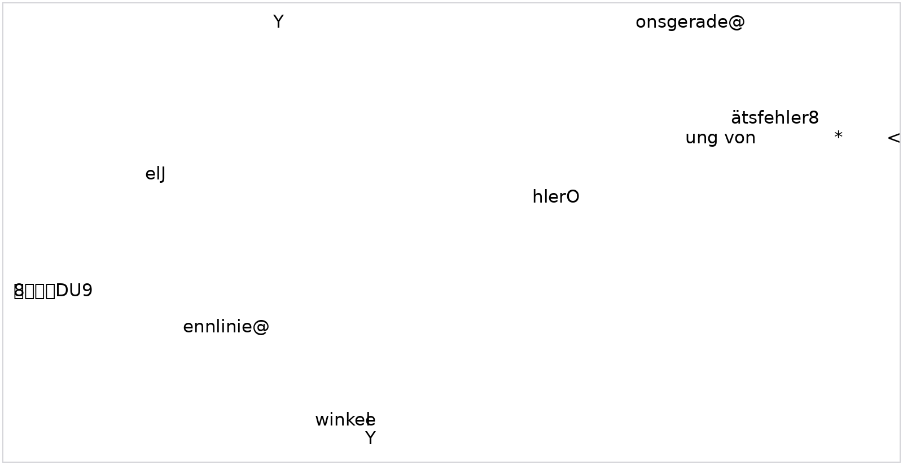

# Lenkmomentenerfassung

> Quelle: `Lenkmomentenerfassung_EXERPT_20160509.xml` · Export 2016-05-17T12:25:38+02:00 · DOORS 9.6.0.1 · 56 Objekte · 4 eingebettete OLE-Abbildungen (als PNG).

| Kennzahl | Wert |
|---|---|
| Objekte / objects | 56 |
| Anforderungen / requirements | 40 |
| Informationen / information | 1 |
| TBD | 0 |
| Überschriften / headings | 15 |
| Abbildungen / figures | 4 |
| Mit EN-Text | 56 |

  <input id="req-q" type="search" placeholder="Nach ID oder Text filtern…" aria-label="Filter requirements" />
  <select id="req-t" aria-label="Filter by type">
    <option value="">Typ: alle</option>
    <option value="Anforderung">Anforderung</option>
    <option value="Information">Information</option>
    <option value="TBD">TBD</option>
    <option value="Überschrift">Überschrift</option>
  </select>
  

## Lenkmomentenerfassung

<code>L_LenkMom_2</code> <code>Überschrift</code> gültig VW: accepted Lieferant: agreed — <strong>Lenkmomentenerfassung</strong>

| | |
|---|---|
| Gültigkeit | gültig |
| Status VW | accepted |
| Status Lieferant | agreed |

### Allgemein

<code>L_LenkMom_244</code> <code>Überschrift</code> gültig VW: accepted Lieferant: agreed — <strong>Allgemein</strong>

| | |
|---|---|
| Gültigkeit | gültig |
| Status VW | accepted |
| Status Lieferant | agreed |

<code>L_LenkMom_3</code> <code>Anforderung</code> gültig VW: accepted Lieferant: agreed

In vorliegendem Modul werden die vom Auftraggeber festgelegten Anforderungen an die Lenkmomentenerfassung der EPS spezifiziert. Es ist eine verbindliche Vorgabe zur Entwicklung der beteiligten Komponenten.

Dieses Modul ist Bestandteil des Lenkungslastenheftes und nur zusammen mit diesem gültig.

| | |
|---|---|
| Gültigkeit | gültig |
| Status VW | accepted |
| Status Lieferant | agreed |

### Projektanforderungen

<code>L_LenkMom_148</code> <code>Überschrift</code> gültig VW: accepted Lieferant: agreed — <strong>Projektanforderungen</strong>

| | |
|---|---|
| Gültigkeit | gültig |
| Status VW | accepted |
| Status Lieferant | agreed |

<code>L_LenkMom_254</code> <code>Anforderung</code> gültig VW: accepted Lieferant: agreed

Für das Lenkmomentensignal muss eine Signalstreckendokumentation erstellt und übergeben werden. Inhaltlich muss die Signalstreckendokumentation mindestens folgendes enthalten:

- Beschreibung der Wirkkette
- Beschreibung Aufbau Sensorik (Funktionsprinzip, mechanischer Aufbau, Blockschaltbild inkl. Benennung verwendeter Sensorelemente inkl. Datenblatt, Fertigungskonzept, Bedatung, Kennlinie, Filterung)
- Beschreibung Schnittstelle Sensorik - ECU (Spannungsversorgung und Pegel (Verhalten Normalbetrieb, Unter- Überspannung), Beschreibung Datenprotokoll, Inhalt Datenprotokoll (Hochlauf, Normalbetrieb, Fehlerfall), Abtastrate
- Signalbearbeitung (Verarbeitung, Filterung, Überwachung) in der ECU. Inklusive Beschreibung der Abhängigkeiten von Betriebszuständen (Hochlauf, Normalbetrieb, Unter-/ Überspannung, Fehlerfall)
- Signallaufzeit (physikalische Größe an Eingangswelle Lenkung bis zur Busausgabe) im Normalbetrieb und im Fehlerfall
- Sicherheitskonzept und Verfügbarkeitinformationen
- Beschreibung der Entwicklersignale

| | |
|---|---|
| Gültigkeit | gültig |
| Status VW | accepted |
| Status Lieferant | agreed |

<code>L_LenkMom_255</code> <code>Anforderung</code> gültig VW: accepted Lieferant: agreed

Für das Lenkmomentensignal muss eine Toleranzrechung erstellt und übergeben werden.

Die Toleranzrechnung bezieht sich auf dem an der Eingangswelle anliegenden Lenkmoment und der als Bussignal ausgegebenen Lenkmomentinformation.
Die Toleranzrechnung muss alle Toleranzen aufschlüsseln und gemeinsam darstellen für:

- Neuteil @ Raumtemperatur
- Neuteil @ Betriebstemperaturbereich
- Lebensdauer @ Betriebstemperaturbereich

Die Toleranzsrechnung muss sowohl den Normalfall als auch den Fall eines ausgefallenen Kanals betrachten und die Richtigkeit der Toleranzrechnung muss validiert werden (siehe unten).

Details der Toleranzrechung inklusive der zugrunde gelegten Daten (Datenblatt, Simulationen, PPAP-Unterlagen, ..)  müssen dem Auftraggeber offengelegt werden.

| | |
|---|---|
| Gültigkeit | gültig |
| Status VW | accepted |
| Status Lieferant | agreed |

<code>L_LenkMom_261</code> <code>Anforderung</code> gültig VW: accepted Lieferant: agreed

Die Erprobungsberichte des im Kapitel "Erprobung" beschriebenen Prüfumfangs müssen dem Auftraggeber zur Verfügung gestellt werden.

| | |
|---|---|
| Gültigkeit | gültig |
| Status VW | accepted |
| Status Lieferant | agreed |

<code>L_LenkMom_173</code> <code>Anforderung</code> gültig VW: accepted Lieferant: agreed

Das Sicherheitskonzept ist vom Entwicklungspartner zu dokumentieren und mit dem Auftraggeber abzustimmen.

| | |
|---|---|
| Gültigkeit | gültig |
| Status VW | accepted |
| Status Lieferant | agreed |

### Produktanforderungen

<code>L_LenkMom_245</code> <code>Überschrift</code> gültig VW: accepted Lieferant: agreed — <strong>Produktanforderungen</strong>

| | |
|---|---|
| Gültigkeit | gültig |
| Status VW | accepted |
| Status Lieferant | agreed |

#### Technische Anforderungen

<code>L_LenkMom_246</code> <code>Überschrift</code> gültig VW: accepted Lieferant: agreed — <strong>Technische Anforderungen</strong>

| | |
|---|---|
| Gültigkeit | gültig |
| Status VW | accepted |
| Status Lieferant | agreed |

#### Randbedingungen für die Auslegung

<code>L_LenkMom_269</code> <code>Überschrift</code> gültig VW: accepted Lieferant: agreed — <strong>Randbedingungen für die Auslegung</strong>

| | |
|---|---|
| Gültigkeit | gültig |
| Status VW | accepted |
| Status Lieferant | agreed |

<code>L_LenkMom_149</code> <code>Anforderung</code> gültig VW: accepted Lieferant: agreed

Die Drehmomentensensorik muss berührungslos und verschleißfrei sein.

| | |
|---|---|
| Gültigkeit | gültig |
| Status VW | accepted |
| Status Lieferant | agreed |

<code>L_LenkMom_152</code> <code>Anforderung</code> gültig VW: accepted Lieferant: agreed

Bei externer Leitungsführung der Sensorik zum Steuergerät muss das Momentensignal digital übertragen werden.

| | |
|---|---|
| Gültigkeit | gültig |
| Status VW | accepted |
| Status Lieferant | agreed |

<code>L_LenkMom_195</code> <code>Anforderung</code> gültig VW: accepted Lieferant: agreed

Die Sensorelektronik ist vor potentiell eindringender Feuchtigkeit zu schützen, falls die Dichtheit nicht im Gesamtsystem gewährleistet ist.

| | |
|---|---|
| Gültigkeit | gültig |
| Status VW | accepted |
| Status Lieferant | agreed |

<code>L_LenkMom_196</code> <code>Anforderung</code> gültig VW: accepted Lieferant: agreed

Das Eigenreibmoment der Drehmomentsensoreinheit muss geringer als 0,05 Nm sein.

| | |
|---|---|
| Gültigkeit | gültig |
| Status VW | accepted |
| Status Lieferant | agreed |

<code>L_LenkMom_156</code> <code>Anforderung</code> gültig VW: accepted Lieferant: agreed

Das Torsionselement ist für eine Torsionssteifigkeit von mindestens 2Nm pro Grad Lenkwinkel auszulegen.

| | |
|---|---|
| Gültigkeit | gültig |
| Status VW | accepted |
| Status Lieferant | agreed |

<code>L_LenkMom_157</code> <code>Anforderung</code> gültig VW: accepted Lieferant: agreed

Der Messbereichdes Momentensensors muss mindestens +-8 Nm, nach Möglichkeit +-10 Nm betragen.

| | |
|---|---|
| Gültigkeit | gültig |
| Status VW | accepted |
| Status Lieferant | agreed |

<code>L_LenkMom_163</code> <code>Anforderung</code> gültig VW: to evaluate Lieferant: to clarify

Der  maximale Verdrehwinkel des Torsionselementes darf nicht grösser als +-7° werden können.

| | |
|---|---|
| Gültigkeit | gültig |
| Status VW | to evaluate |
| Status Lieferant | to clarify |

<code>L_LenkMom_167</code> <code>Anforderung</code> gültig VW: accepted Lieferant: agreed

Im Arbeitsbereich des Momentensensors sind keine Geräusche zulässig.

| | |
|---|---|
| Gültigkeit | gültig |
| Status VW | accepted |
| Status Lieferant | agreed |

#### Sensorperformance

<code>L_LenkMom_270</code> <code>Überschrift</code> gültig VW: accepted Lieferant: agreed — <strong>Sensorperformance</strong>

| | |
|---|---|
| Gültigkeit | gültig |
| Status VW | accepted |
| Status Lieferant | agreed |

<code>L_LenkMom_271</code> <code>Information</code> gültig VW: accepted Lieferant: agreed

<u>Definitionen Fehler Sensorkennlinie:</u>

<figure class="req-figure" id="fig-271_2_1">
  
  <figcaption>Abbildung <code>271_2_1</code> · L_LenkMom_271 — <a href="../../docs/public/assets/Lenkmomentenerfassung_EXERPT_20160509/271_2_1.png" target="_blank" rel="noopener">open full size</a></figcaption>
</figure>

<u>Definition Auflösung:</u>
Auflösung beschreibt die kleinste Änderung der zu messenden Größe, die vom Sensor erfasst werden kann.

<u>Definition Momentenabweichung:</u>

Momentenabweichung = |Lenkmomentensignal am Bus   -  anliegendes Moment an der Eingangswelle der Lenkung |

<u>Definition Sensorwelligkeit:</u>

Fehler des Sensorausgangswertes bei konstantem Eingangswert hervorgerufen durch eine Änderung des Lenkwinkels.

| | |
|---|---|
| Gültigkeit | gültig |
| Status VW | accepted |
| Status Lieferant | agreed |

<code>L_LenkMom_164</code> <code>Anforderung</code> gültig VW: to evaluate Lieferant: to clarify

Die Performance muss auch bei der systembedingten maximalen Verbiegung der Lenkwelle nachgewiesen werden.

| | |
|---|---|
| Gültigkeit | gültig |
| Status VW | to evaluate |
| Status Lieferant | to clarify |

<code>L_LenkMom_222</code> <code>Anforderung</code> gültig VW: accepted Lieferant: agreed

Die Auflösung muß mindestens 0,01 Nm betragen.

| | |
|---|---|
| Gültigkeit | gültig |
| Status VW | accepted |
| Status Lieferant | agreed |

<code>L_LenkMom_216</code> <code>Anforderung</code> gültig VW: accepted Lieferant: agreed

Die maximale Momentenabweichung im fehlerfreien Fall muss kleiner gleich:

- ±0,10 Nm ± 3% vom Messwert  (bei Neuteil und Raumtemperatur)
- ±0,15 Nm ± 5% vom Messwert  (bei Neuteil im Betriebstemperaturbereich)
- ±0,25 Nm ± 10% vom Messwert  (über Lebensdauer im Betriebstemperaturbereich)

 betragen.

| | |
|---|---|
| Gültigkeit | gültig |
| Status VW | accepted |
| Status Lieferant | agreed |

<code>L_LenkMom_223</code> <code>Anforderung</code> gültig VW: to evaluate Lieferant: to clarify

Die Hysterese des Lenkmomentsensors im verbauten Zustand im Lenksystems darf im fehlerfreien Fall bei maximaler Momentenänderung maximal 0,15 Nm betragen.

| | |
|---|---|
| Gültigkeit | gültig |
| Status VW | to evaluate |
| Status Lieferant | to clarify |

<code>L_LenkMom_217</code> <code>Anforderung</code> gültig VW: accepted Lieferant: agreed

Der Phasenverzug (Signalalter) zwischen Lenk-Momenten-Information am Kommunikationsbus  (SG-Ausgang) und Moment am Eingang Lenkwelle muss im fehlerfreiem Fall &lt; 5 ms sein.

| | |
|---|---|
| Gültigkeit | gültig |
| Status VW | accepted |
| Status Lieferant | agreed |

<code>L_LenkMom_218</code> <code>Anforderung</code> gültig VW: to evaluate Lieferant: to clarify

Bei Lenkmomenten &lt; 1 Nm darf die Gesamtamplitude der Sensorwelligkeit maximal 0,04 Nm betragen.

| | |
|---|---|
| Gültigkeit | gültig |
| Status VW | to evaluate |
| Status Lieferant | to clarify |

<code>L_LenkMom_272</code> <code>Anforderung</code> gültig VW: accepted Lieferant: agreed

Bei Lenkmomenten &gt; 1 Nm und &lt; 10 Nm darf die Gesamtamplitude der Sensorwelligkeit maximal 0,3 Nm betragen.

| | |
|---|---|
| Gültigkeit | gültig |
| Status VW | accepted |
| Status Lieferant | agreed |

<code>L_LenkMom_219</code> <code>Anforderung</code> gültig VW: accepted Lieferant: agreed

Der max. Gradient der Sensorwelligkeit darf +-0,04Nm/° sein.

| | |
|---|---|
| Gültigkeit | gültig |
| Status VW | accepted |
| Status Lieferant | agreed |

<code>L_LenkMom_273</code> <code>Anforderung</code> gültig VW: accepted Lieferant: agreed

Dasrms_Rauschen muss kleiner/gleich  ±0,02 Nm sein

| | |
|---|---|
| Gültigkeit | gültig |
| Status VW | accepted |
| Status Lieferant | agreed |

<code>L_LenkMom_172</code> <code>Anforderung</code> gültig VW: accepted Lieferant: agreed

Beeinträchtigung des Lenkverhaltens durch Sensorfehler ist nicht zulässig.
Sensorfehler setzen sich aus mechanischen Fehlern, physikalischen Messfehlern, elektronischer Signalkonfektionierung, elektronischer Signalübertragung und elektronischer Signalauswertung zusammen.

| | |
|---|---|
| Gültigkeit | gültig |
| Status VW | accepted |
| Status Lieferant | agreed |

#### Sicherheitsanforderungen

<code>L_LenkMom_253</code> <code>Überschrift</code> gültig VW: accepted Lieferant: agreed — <strong>Sicherheitsanforderungen</strong>

| | |
|---|---|
| Gültigkeit | gültig |
| Status VW | accepted |
| Status Lieferant | agreed |

<code>L_LenkMom_150</code> <code>Anforderung</code> gültig VW: accepted Lieferant: agreed

Es muss ein ASIL-D Signal des Lenkmomentes in der Lenksystem-SW vorliegen.

| | |
|---|---|
| Gültigkeit | gültig |
| Status VW | accepted |
| Status Lieferant | agreed |

<code>L_LenkMom_199</code> <code>Anforderung</code> gültig VW: accepted Lieferant: agreed

Die Ausfallwarscheinlichkeit des Sensorsystem (mit Eingangsbeschaltung ECU) darf 50 FIT nicht überschreiten.

| | |
|---|---|
| Gültigkeit | gültig |
| Status VW | accepted |
| Status Lieferant | agreed |

<code>L_LenkMom_151</code> <code>Anforderung</code> gültig VW: accepted Lieferant: agreed

Nach einem Einfachfehler eines Bauteiles auf der zur Signalerzeugung notwendigen Wirkkette muss weiterhin ein ASIL-D Signal des Lenkmomentes in der Lenksystem-SW vorliegen.

(Bauteile die auch für die generelle Funktionsweise der Lenkung notwendig sind, z.B. ein Microcontroller, Preregulator können nach Rücksprache mit der Fachabteilung von der Betrachtung ausgenommen werden.)

| | |
|---|---|
| Gültigkeit | gültig |
| Status VW | accepted |
| Status Lieferant | agreed |

<code>L_LenkMom_239</code> <code>Anforderung</code> gültig VW: accepted Lieferant: agreed

Die Ausfallwarscheinlichkeit des Sensorsystem (mit Eingangsbeschaltung ECU) nach einem Einfachfehler darf 50 FIT nicht überschreiten.

| | |
|---|---|
| Gültigkeit | gültig |
| Status VW | accepted |
| Status Lieferant | agreed |

<code>L_LenkMom_236</code> <code>Anforderung</code> gültig VW: accepted Lieferant: agreed

Der Weiterbetrieb nach einem Einzelfehler muss unabhängig von Fahrzeuginformationen und ohne gesonderte Fahrzeugabstimmung erfolgen.

| | |
|---|---|
| Gültigkeit | gültig |
| Status VW | accepted |
| Status Lieferant | agreed |

Kommentare

<strong>Nexteer:</strong> Alternative option to be discussed

<code>L_LenkMom_274</code> <code>Anforderung</code> gültig VW: accepted Lieferant: agreed

Die Sicherheitsgrenzen und die Fehlertoleranzzeit, bei denen ein fehlerhaftes Signal erkannt werden muss, fallen nicht notwendigerweise mit den Grenzen der unter dem Kapitel "Sensorperformance" spezifizierten Grenzswerte zusammen.

Die Sicherheitsgrenzen und die Fehlertoleranzzeit müssen projektabhängig ermittelt werden (z.B. Probandentests) und können zunächst mit 2 Nm Abweichung zwischen gemessenem und real vorhandenem Moment mit einer Fehlertoleranzzeit von 20 ms angenommen werden.

| | |
|---|---|
| Gültigkeit | gültig |
| Status VW | accepted |
| Status Lieferant | agreed |

<code>L_LenkMom_198</code> <code>Anforderung</code> gültig VW: accepted Lieferant: agreed

Alle Sensorfehler müssen bei ihrem Auftreten diagnostiziert werden.

| | |
|---|---|
| Gültigkeit | gültig |
| Status VW | accepted |
| Status Lieferant | agreed |

#### Busausgabe

<code>L_LenkMom_247</code> <code>Überschrift</code> gültig VW: accepted Lieferant: agreed — <strong>Busausgabe</strong>

| | |
|---|---|
| Gültigkeit | gültig |
| Status VW | accepted |
| Status Lieferant | agreed |

<code>L_LenkMom_275</code> <code>Anforderung</code> gültig VW: accepted Lieferant: agreed

Die Lenkmomenteninformation muss mit der ersten gesendeten Botschaft gültig sein und dem gemessenen Wert entsprechen.

| | |
|---|---|
| Gültigkeit | gültig |
| Status VW | accepted |
| Status Lieferant | agreed |

#### Implementierungsvorgaben

<code>L_LenkMom_249</code> <code>Überschrift</code> gültig VW: accepted Lieferant: agreed — <strong>Implementierungsvorgaben</strong>

| | |
|---|---|
| Gültigkeit | gültig |
| Status VW | accepted |
| Status Lieferant | agreed |

#### Fehlerbehandlung

<code>L_LenkMom_250</code> <code>Überschrift</code> gültig VW: accepted Lieferant: agreed — <strong>Fehlerbehandlung</strong>

| | |
|---|---|
| Gültigkeit | gültig |
| Status VW | accepted |
| Status Lieferant | agreed |

<code>L_LenkMom_175</code> <code>Anforderung</code> gültig VW: accepted Lieferant: agreed

Der Momentensensor muss in das Diagnosekonzept der Lenkung integriert werden und unter der gleichen Diagnoseadresse erreichbar sein (Diagnoseadresse 44).

| | |
|---|---|
| Gültigkeit | gültig |
| Status VW | accepted |
| Status Lieferant | agreed |

### Erprobungsanforderungen

<code>L_LenkMom_248</code> <code>Überschrift</code> gültig VW: accepted Lieferant: agreed — <strong>Erprobungsanforderungen</strong>

| | |
|---|---|
| Gültigkeit | gültig |
| Status VW | accepted |
| Status Lieferant | agreed |

#### Performancevalidierung

<code>L_LenkMom_262</code> <code>Überschrift</code> gültig VW: accepted Lieferant: agreed — <strong>Performancevalidierung</strong>

| | |
|---|---|
| Gültigkeit | gültig |
| Status VW | accepted |
| Status Lieferant | agreed |

<code>L_LenkMom_256</code> <code>Anforderung</code> gültig VW: accepted Lieferant: agreed

Die Ergebnisse der Toleranzrechnung für die "maximale Abweichung Neuteil @ Raumtemperatur"muss für jedes Musterteil durch entsprechende Messung validiert werden.

| | |
|---|---|
| Gültigkeit | gültig |
| Status VW | accepted |
| Status Lieferant | agreed |

<code>L_LenkMom_257</code> <code>Anforderung</code> gültig VW: accepted Lieferant: agreed

Die Ergebnisse der Toleranzrechung für die "maximale Abweichung Neuteil @ Betriebstemperatur" muss durch entsprechende Messung an einer ausreichend großen Stichprobe für jeden Musterstand validiert werden.

| | |
|---|---|
| Gültigkeit | gültig |
| Status VW | accepted |
| Status Lieferant | agreed |

<code>L_LenkMom_258</code> <code>Anforderung</code> gültig VW: accepted Lieferant: agreed

Die Ergebnisse der Toleranzrechung für die "maximale Abweichung über Lebensdauer @ Betriebstemperaturbereich" muss anhand von DV/PV-Teilen durch entsprechende Vergleichsmessungen (vor und nach dem Test) validiert werden.

| | |
|---|---|
| Gültigkeit | gültig |
| Status VW | accepted |
| Status Lieferant | agreed |

<code>L_LenkMom_259</code> <code>Anforderung</code> gültig VW: accepted Lieferant: agreed

Die Ergebnisse der Toleranzrechung für die "maximale Abweichung über Lebensdauer @ Betriebstemperaturbereich" muss anhand von ausgewählten Fahrzeugdauerlaufendeteilen durch entsprechende Vergleichsmessungen (vor und nach dem Fahrzeugdauerlauf) validiert werden.

| | |
|---|---|
| Gültigkeit | gültig |
| Status VW | accepted |
| Status Lieferant | agreed |

#### Umwelterprobung

<code>L_LenkMom_263</code> <code>Überschrift</code> gültig VW: accepted Lieferant: agreed — <strong>Umwelterprobung</strong>

| | |
|---|---|
| Gültigkeit | gültig |
| Status VW | accepted |
| Status Lieferant | agreed |

<code>L_LenkMom_264</code> <code>Anforderung</code> gültig VW: accepted Lieferant: agreed

Der Sensor muss separat nach VW 80000 getestet werden. Es gelten die Randbedingunen des Moduls "Erprobung Elektrik und Elektronik".

Abweichend werden die Prüfungsspannungen zur Sensor-Versorgung angepasst:  z.B. VDD = nominell 5 V
-&gt; Betriebsspannungsbereich ist 4,5V bis 5,5V.

| | |
|---|---|
| Gültigkeit | gültig |
| Status VW | accepted |
| Status Lieferant | agreed |

<code>L_LenkMom_265</code> <code>Anforderung</code> gültig VW: accepted Lieferant: agreed

Zusätzlich zur VW 80000 gelten folgende Ergänzungen:

Die Prüflinge müssen vor und nach der Prüfung vollständig charakterisiert / vermessen werden.
Die Prüflinge müssen während des Prüfverlaufs hinsichtlich Ihrer Sensorperformance überwacht werden.
 Die vorgegebenen Toleranzen in Form und Funktion müssen eingehalten werden.

| | |
|---|---|
| Gültigkeit | gültig |
| Status VW | accepted |
| Status Lieferant | agreed |

#### Elektromagnetische Verträglichkeit

<code>L_LenkMom_266</code> <code>Überschrift</code> gültig VW: accepted Lieferant: agreed — <strong>Elektromagnetische Verträglichkeit</strong>

| | |
|---|---|
| Gültigkeit | gültig |
| Status VW | accepted |
| Status Lieferant | agreed |

<code>L_LenkMom_267</code> <code>Anforderung</code> gültig VW: accepted Lieferant: agreed

Der Sensor muss getrennt nach:

<figure class="req-figure" id="fig-267_2_1">
  
  <figcaption>Abbildung <code>267_2_1</code> · L_LenkMom_267 — <a href="../../docs/public/assets/Lenkmomentenerfassung_EXERPT_20160509/267_2_1.png" target="_blank" rel="noopener">open full size</a>  Embedded source: <a href="../../docs/public/assets/Lenkmomentenerfassung_EXERPT_20160509/267_2_1.bin" download>source <code>267_2_1.bin</code></a></figcaption>
</figure>

Transkription (durchsuchbarer Text)

TL 81000 EMV von Kfz-Elektronikbauteilen ECE R10EMV Kraftfahrzeugrichtlinie CISPR 25 Fahrzeuge, Boote und von Verbrennungsmotoren angetriebene Geräte - Funkstöreigenschaften -Grenzwerte und Messverfahren für den Schutz von an Bord befindlichen Empfängern

getestet werden. Es gelten die Randbedingungen des Moduls "Elektromagnetische Vertraeglichkeit".

| | |
|---|---|
| Gültigkeit | gültig |
| Status VW | accepted |
| Status Lieferant | agreed |

<code>L_LenkMom_282</code> <code>Anforderung</code> gültig VW: to evaluate Lieferant: agreed

Die Sensorperformanceanforderungen gelten auch während der Störfestigkeitsanforderungen - speziell bei den Magnetfeldprügfungen im unteren Frequenzbereich.
Die Ausrichtung der beaufschlagten Störungen muss mit dem Auftraggeber abgestimmt werden und im Prüfplan definiert werden.

| | |
|---|---|
| Gültigkeit | gültig |
| Status VW | to evaluate |
| Status Lieferant | agreed |

---
*Original: RIF `Lenkmomentenerfassung_EXERPT_20160509.xml` · DOORS-Export vom 2016-05-17T12:25:38+02:00. OLE-Objekte (Word/Excel/Paint) wurden originalgetreu als PNG eingebettet (Bitmap-DIBs 1:1, Vektor-WMF als saubere Nachzeichnung inkl. Transkription); Originale sind pro Abbildung verlinkt.*