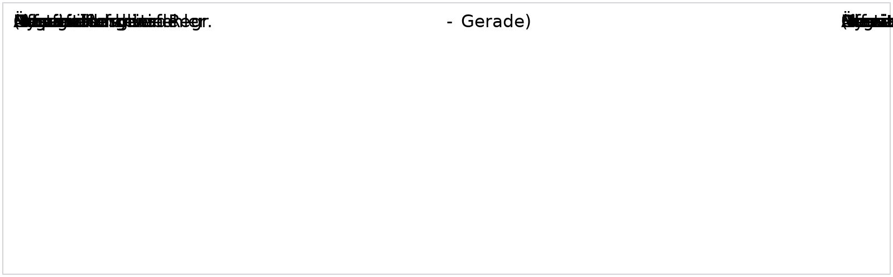

# Steering-Torque Sensing

:::note
Default language is **English**. Official DOORS English is used where present (56/56 objects); the remaining 0 objects carry a yellow **MT** badge (machine-translated from German with Helsinki-NLP/opus-mt-de-en + automotive glossary; type `MT` in the filter box to list them). Use the language switcher for the full German edition.
:::

| Metric | Value |
|---|---|
| Objekte / objects | 56 |
| Anforderungen / requirements | 40 |
| Informationen / information | 1 |
| TBD | 0 |
| Überschriften / headings | 15 |
| Abbildungen / figures | 4 |
| Official EN text | 56 (100%) |
| Machine-translated EN | 0 |

  <input id="req-q" type="search" placeholder="Filter by ID or text…" aria-label="Filter requirements" />
  <select id="req-t" aria-label="Filter by type">
    <option value="">Type: all</option>
    <option value="Anforderung">Anforderung · requirement</option>
    <option value="Information">Information · information</option>
    <option value="TBD">TBD · TBD</option>
    <option value="Überschrift">Überschrift · heading</option>
  </select>
  

## Steering Torque Sensing

<code>L_LenkMom_2</code> <code>Überschrift</code> · heading valid VW: accepted Supplier: agreed — <strong>Steering Torque Sensing</strong>

| | |
|---|---|
| Validity | valid (DE: gültig) |
| Status VW | accepted |
| Status supplier | agreed |

### General information

<code>L_LenkMom_244</code> <code>Überschrift</code> · heading valid VW: accepted Supplier: agreed — <strong>General information</strong>

| | |
|---|---|
| Validity | valid (DE: gültig) |
| Status VW | accepted |
| Status supplier | agreed |

<code>L_LenkMom_3</code> <code>Anforderung</code> · requirement valid VW: accepted Supplier: agreed

The present module specifies the requirements set forth by the purchaser for the steering torque sensing of the EPS. It is mandatory for the development of the components involved.

This module is part of the Steering System Performance Specifications and is only valid together with it.

| | |
|---|---|
| Validity | valid (DE: gültig) |
| Status VW | accepted |
| Status supplier | agreed |

### Project requirements

<code>L_LenkMom_148</code> <code>Überschrift</code> · heading valid VW: accepted Supplier: agreed — <strong>Project requirements</strong>

| | |
|---|---|
| Validity | valid (DE: gültig) |
| Status VW | accepted |
| Status supplier | agreed |

<code>L_LenkMom_254</code> <code>Anforderung</code> · requirement valid VW: accepted Supplier: agreed

A signal path documentation must be prepared and submitted for the steering torque signal. The signal path documentation must include at least the following information:
•	Description of the active chain
•	Description of the sensor system design (functional principle, mechanical design, block circuit diagram including a designation of the sensor elements used including data sheet, manufacturing solution, calibration, characteristic curve, filtering)
•	Description of the interface between sensor system and control module (voltage supply and voltage level (characteristics during normal operation, under/overvoltage), description of the data protocol, data protocol content (run-up, normal operation, fault case), sampling rate
•	Signal processing (processing, filtering, monitoring) in the control module including a description of the dependencies on operating states (run-up, normal operation, under/overvoltage, fault case)
•	Signal transit times (physical variables at the steering system input shaft up to the bus output) during normal operation and in case of faults
•	Safety strategy and information on availability
Description of the developer signals

| | |
|---|---|
| Validity | valid (DE: gültig) |
| Status VW | accepted |
| Status supplier | agreed |

<code>L_LenkMom_255</code> <code>Anforderung</code> · requirement valid VW: accepted Supplier: agreed

A tolerance computation must be prepared and submitted for the steering torque signal.

The tolerance computation refers to the steering torque applied on the input shaft and the steering torque information output as a bus signal.
The tolerance computation must break down all tolerances and represent these jointly for:
•	New parts at room temperature
•	New parts in the operating temperature range
•	Service life in the operating temperature range

The tolerance computation must analyze the normal case (typical circumstances) as well as the case of a channel failure; the accuracy of the tolerance computation must be validated (see below).

Details of the tolerance computation including the data on which the computation is based (data sheet, simulations, PPAP documents, etc.) must be disclosed to the purchaser.

| | |
|---|---|
| Validity | valid (DE: gültig) |
| Status VW | accepted |
| Status supplier | agreed |

<code>L_LenkMom_261</code> <code>Anforderung</code> · requirement valid VW: accepted Supplier: agreed

The reliability testing reports for the tests described in the "Reliability testing" section must be made available to the purchaser.

| | |
|---|---|
| Validity | valid (DE: gültig) |
| Status VW | accepted |
| Status supplier | agreed |

<code>L_LenkMom_173</code> <code>Anforderung</code> · requirement valid VW: accepted Supplier: agreed

The safety concept must be documented by the development partner and agreed with the purchaser.

| | |
|---|---|
| Validity | valid (DE: gültig) |
| Status VW | accepted |
| Status supplier | agreed |

### Product requirements

<code>L_LenkMom_245</code> <code>Überschrift</code> · heading valid VW: accepted Supplier: agreed — <strong>Product requirements</strong>

| | |
|---|---|
| Validity | valid (DE: gültig) |
| Status VW | accepted |
| Status supplier | agreed |

#### Technical requirements

<code>L_LenkMom_246</code> <code>Überschrift</code> · heading valid VW: accepted Supplier: agreed — <strong>Technical requirements</strong>

| | |
|---|---|
| Validity | valid (DE: gültig) |
| Status VW | accepted |
| Status supplier | agreed |

#### Boundary conditions for the design

<code>L_LenkMom_269</code> <code>Überschrift</code> · heading valid VW: accepted Supplier: agreed — <strong>Boundary conditions for the design</strong>

| | |
|---|---|
| Validity | valid (DE: gültig) |
| Status VW | accepted |
| Status supplier | agreed |

<code>L_LenkMom_149</code> <code>Anforderung</code> · requirement valid VW: accepted Supplier: agreed

The torque sensors must be non-contacting and non-wearing.

| | |
|---|---|
| Validity | valid (DE: gültig) |
| Status VW | accepted |
| Status supplier | agreed |

<code>L_LenkMom_152</code> <code>Anforderung</code> · requirement valid VW: accepted Supplier: agreed

If the cables are routed externally from the sensor system to the electronic control unit, the torque signal must be transmitted digitally.

| | |
|---|---|
| Validity | valid (DE: gültig) |
| Status VW | accepted |
| Status supplier | agreed |

<code>L_LenkMom_195</code> <code>Anforderung</code> · requirement valid VW: accepted Supplier: agreed

The sensor electronics must be protected against potential moisture penetration if the overall system does not ensure leak tightness.

| | |
|---|---|
| Validity | valid (DE: gültig) |
| Status VW | accepted |
| Status supplier | agreed |

<code>L_LenkMom_196</code> <code>Anforderung</code> · requirement valid VW: accepted Supplier: agreed

The internal friction torque of the torque sensor unit must be less than 0,05 Nm.

| | |
|---|---|
| Validity | valid (DE: gültig) |
| Status VW | accepted |
| Status supplier | agreed |

<code>L_LenkMom_156</code> <code>Anforderung</code> · requirement valid VW: accepted Supplier: agreed

The torsional element must be designed for a torsional stiffness of at least 2 Nm per degree of steering angle.

| | |
|---|---|
| Validity | valid (DE: gültig) |
| Status VW | accepted |
| Status supplier | agreed |

<code>L_LenkMom_157</code> <code>Anforderung</code> · requirement valid VW: accepted Supplier: agreed

The measuring rangeof the torque sensor must be at least +-8 Nm, if possible +/-10 Nm.

| | |
|---|---|
| Validity | valid (DE: gültig) |
| Status VW | accepted |
| Status supplier | agreed |

<code>L_LenkMom_163</code> <code>Anforderung</code> · requirement valid VW: to evaluate Supplier: to clarify

It must not be possible for the max. angle of rotation of the torsional element to exceed +/-7°.

| | |
|---|---|
| Validity | valid (DE: gültig) |
| Status VW | to evaluate |
| Status supplier | to clarify |

<code>L_LenkMom_167</code> <code>Anforderung</code> · requirement valid VW: accepted Supplier: agreed

No noises are permitted in the operating range of the torque sensor.

| | |
|---|---|
| Validity | valid (DE: gültig) |
| Status VW | accepted |
| Status supplier | agreed |

#### Sensor performance

<code>L_LenkMom_270</code> <code>Überschrift</code> · heading valid VW: accepted Supplier: agreed — <strong>Sensor performance</strong>

| | |
|---|---|
| Validity | valid (DE: gültig) |
| Status VW | accepted |
| Status supplier | agreed |

<code>L_LenkMom_271</code> <code>Information</code> · information valid VW: accepted Supplier: agreed

<u>Definitions of faults in the sensor's characteristic curve:</u>

<figure class="req-figure" id="fig-271_9_1">
  
  <figcaption>Figure <code>271_9_1</code> · L_LenkMom_271 — <a href="../../docs/public/assets/Lenkmomentenerfassung_EXERPT_20160509/271_9_1.png" target="_blank" rel="noopener">open full size</a></figcaption>
</figure>

<figure class="req-figure" id="fig-271_9_2">
  
  <figcaption>Figure <code>271_9_2</code> · L_LenkMom_271 — <a href="../../docs/public/assets/Lenkmomentenerfassung_EXERPT_20160509/271_9_2.png" target="_blank" rel="noopener">open full size</a>  Embedded source: <a href="../../docs/public/assets/Lenkmomentenerfassung_EXERPT_20160509/271_9_2.bin" download>source <code>271_9_2.bin</code></a></figcaption>
</figure>

Transcription (English, machine-translated — searchable text)

Measured value Regression straight lineRegression line Linearity errorLinearity error (Deviation from the regression line) Offset error Offset lazy Measurand Nominal characteristic curve Sensitivity error Sensitivity error Äs Äs Äs Äs Äs Äs Äs Äs Äs Äs Äs Äs Äs Äs Äs Äs Äs Äs Äs Äs Äs Äs Äs Äs Äs Äs Äs Äs Äs Äs Äs Äs Äs Äs Äs Äs Äs Äs Äs Äs Äs Äs Äs Äs Äs Äs Äs Äs Äs Äs Äs Äs Äs Äs Äs Äs Äs Äs Äs Äs Äs Äs Äs Äs Äs Äs Äs Äs Äs Äs Äs Äs Äs Äs Äs Äs Äs Äs Äs Äs Äs Äs Äs Äs Äs Äs Äs Äs Äs Äs Äs Äs Äs Äs Äs Äs Äs Äs Äs Äs Äs Äs Äs Äs Äs Äs Äs Äs Äs Äs Äs Äs Ä Ä Äs Äs Äs Ä Ä Ä Äs Äs Ä Ä Ä Ä Ä Ä Ä Ä Ä Ä Ä Ä Ä Äs Ä Ä Ä Ä Ä Ä Ä Ä Ä Ä Ä Ä Ä Ä Ä Ä Ä Ä Äs Äs Äs Ä Ä Ä Ä Ä Ä Ä Ä Ä Ä Ä Ä Ä Ä Ä Ä Ä Ä Ä Ä Ä Ä Ä Ä Ä Ä Ä Ä Ä Ä Ä Ä Ä Ä Ä Ä Ä Hysteresis Hysteresis

<u>Definition of resolution:</u>
Resolution describes the smallest change in the measured variable that the sensor is able to detect.

<u>Definition of torque deviation:</u>
Torque deviation = |steering torque signal on the bus  -  torque on the input shaft of the steering system|

<u>Definition of sensor waviness:</u>
Fault of the sensor's output value at a constant input value caused by a change in the steering angle.

| | |
|---|---|
| Validity | valid (DE: gültig) |
| Status VW | accepted |
| Status supplier | agreed |

<code>L_LenkMom_164</code> <code>Anforderung</code> · requirement valid VW: to evaluate Supplier: to clarify

Performance must also be demonstrated with the system-related maximum bending of the steering shaft.

| | |
|---|---|
| Validity | valid (DE: gültig) |
| Status VW | to evaluate |
| Status supplier | to clarify |

<code>L_LenkMom_222</code> <code>Anforderung</code> · requirement valid VW: accepted Supplier: agreed

The resolution must be at least 0,01 Nm.

| | |
|---|---|
| Validity | valid (DE: gültig) |
| Status VW | accepted |
| Status supplier | agreed |

<code>L_LenkMom_216</code> <code>Anforderung</code> · requirement valid VW: accepted Supplier: agreed

The maximum torque deviation in the fault-free case must be less than or equal to:

•	±0,10 Nm ± 3% of the measured value (for a new part at room temperature)
•	±0,15 Nm ± 5% of the measured value (for a new part in the operating temperature range)
±0,25 Nm ± 10% of the measured value (over the service life in the operating temperature range)

| | |
|---|---|
| Validity | valid (DE: gültig) |
| Status VW | accepted |
| Status supplier | agreed |

<code>L_LenkMom_223</code> <code>Anforderung</code> · requirement valid VW: to evaluate Supplier: to clarify

The hysteresis of the steering torque sensor when in the installed condition in the steering system must not exceed 0,15 Nm in the fault-free case with maximum torque change.

| | |
|---|---|
| Validity | valid (DE: gültig) |
| Status VW | to evaluate |
| Status supplier | to clarify |

<code>L_LenkMom_217</code> <code>Anforderung</code> · requirement valid VW: accepted Supplier: agreed

The phase delay (signal age) between the steering torque information on the communication bus (control module output) and the torque at the steering shaft input must be &lt;5 ms in the fault-free case.

| | |
|---|---|
| Validity | valid (DE: gültig) |
| Status VW | accepted |
| Status supplier | agreed |

<code>L_LenkMom_218</code> <code>Anforderung</code> · requirement valid VW: to evaluate Supplier: to clarify

For steering torques &lt;1 Nm, the total amplitude of the sensor waviness must not exceed 0,04 Nm.

| | |
|---|---|
| Validity | valid (DE: gültig) |
| Status VW | to evaluate |
| Status supplier | to clarify |

<code>L_LenkMom_272</code> <code>Anforderung</code> · requirement valid VW: accepted Supplier: agreed

For steering torques &gt;1 Nm and &lt;10 Nm, the total amplitude of the sensor waviness must not exceed 0,3 Nm.

| | |
|---|---|
| Validity | valid (DE: gültig) |
| Status VW | accepted |
| Status supplier | agreed |

<code>L_LenkMom_219</code> <code>Anforderung</code> · requirement valid VW: accepted Supplier: agreed

The maximum gradient of the sensor waviness must not exceed +/-0,04 Nm/°.

| | |
|---|---|
| Validity | valid (DE: gültig) |
| Status VW | accepted |
| Status supplier | agreed |

<code>L_LenkMom_273</code> <code>Anforderung</code> · requirement valid VW: accepted Supplier: agreed

Therms_noise must be less than or equal to ±0,02 Nm

| | |
|---|---|
| Validity | valid (DE: gültig) |
| Status VW | accepted |
| Status supplier | agreed |

<code>L_LenkMom_172</code> <code>Anforderung</code> · requirement valid VW: accepted Supplier: agreed

Sensor errors must not negatively affect the steering behavior.
Sensor errors consist of mechanical faults, physical measurement errors, electronic signal packaging, electronic signal transmission, and electronic signal evaluation.

| | |
|---|---|
| Validity | valid (DE: gültig) |
| Status VW | accepted |
| Status supplier | agreed |

#### Safety requirements

<code>L_LenkMom_253</code> <code>Überschrift</code> · heading valid VW: accepted Supplier: agreed — <strong>Safety requirements</strong>

| | |
|---|---|
| Validity | valid (DE: gültig) |
| Status VW | accepted |
| Status supplier | agreed |

<code>L_LenkMom_150</code> <code>Anforderung</code> · requirement valid VW: accepted Supplier: agreed

An ASIL-D signal of the steering torque must be present in the steering system software.

| | |
|---|---|
| Validity | valid (DE: gültig) |
| Status VW | accepted |
| Status supplier | agreed |

<code>L_LenkMom_199</code> <code>Anforderung</code> · requirement valid VW: accepted Supplier: agreed

The sensor system's probability of failure (with control module input circuitry) must not exceed 50 FIT.

| | |
|---|---|
| Validity | valid (DE: gültig) |
| Status VW | accepted |
| Status supplier | agreed |

<code>L_LenkMom_151</code> <code>Anforderung</code> · requirement valid VW: accepted Supplier: agreed

The ASIL-D signal of the steering torque must continue to be present in the steering system software after a single fault of a component on the active chain required for the signal generation.

(Components that are also required for the general steering system function, e.g., microcontroller, pre-regulator, may be excluded from the analysis after consultation with the appropriate department.)

| | |
|---|---|
| Validity | valid (DE: gültig) |
| Status VW | accepted |
| Status supplier | agreed |

<code>L_LenkMom_239</code> <code>Anforderung</code> · requirement valid VW: accepted Supplier: agreed

The sensor system's probability of failure (with control module input circuitry) after a single fault must not exceed 50 FIT.

| | |
|---|---|
| Validity | valid (DE: gültig) |
| Status VW | accepted |
| Status supplier | agreed |

<code>L_LenkMom_236</code> <code>Anforderung</code> · requirement valid VW: accepted Supplier: agreed

Continued operation after a single fault must be ensured independently of the vehicle information and without special vehicle adjustments.

| | |
|---|---|
| Validity | valid (DE: gültig) |
| Status VW | accepted |
| Status supplier | agreed |

Comments

<strong>Nexteer:</strong> Alternative option to be discussed

<code>L_LenkMom_274</code> <code>Anforderung</code> · requirement valid VW: accepted Supplier: agreed

The safety limits and fault tolerance period for which a faulty signal must be detected, do not necessarily coincide with the limits specified in the "Sensor performance" section.

The safety limits and fault tolerance period must be determined project-specifically (e.g., tests with test subjects) and can initially be assumed as 2 Nm deviation between the measured and actual torque, with a fault tolerance period of 20 ms.

| | |
|---|---|
| Validity | valid (DE: gültig) |
| Status VW | accepted |
| Status supplier | agreed |

<code>L_LenkMom_198</code> <code>Anforderung</code> · requirement valid VW: accepted Supplier: agreed

All sensor errors must be diagnosed on occurrence.

| | |
|---|---|
| Validity | valid (DE: gültig) |
| Status VW | accepted |
| Status supplier | agreed |

#### Bus output

<code>L_LenkMom_247</code> <code>Überschrift</code> · heading valid VW: accepted Supplier: agreed — <strong>Bus output</strong>

| | |
|---|---|
| Validity | valid (DE: gültig) |
| Status VW | accepted |
| Status supplier | agreed |

<code>L_LenkMom_275</code> <code>Anforderung</code> · requirement valid VW: accepted Supplier: agreed

The steering torque information must be valid with the first transmitted message and correspond to the measured value.

| | |
|---|---|
| Validity | valid (DE: gültig) |
| Status VW | accepted |
| Status supplier | agreed |

#### Implementation specifications

<code>L_LenkMom_249</code> <code>Überschrift</code> · heading valid VW: accepted Supplier: agreed — <strong>Implementation specifications</strong>

| | |
|---|---|
| Validity | valid (DE: gültig) |
| Status VW | accepted |
| Status supplier | agreed |

#### Fault handling

<code>L_LenkMom_250</code> <code>Überschrift</code> · heading valid VW: accepted Supplier: agreed — <strong>Fault handling</strong>

| | |
|---|---|
| Validity | valid (DE: gültig) |
| Status VW | accepted |
| Status supplier | agreed |

<code>L_LenkMom_175</code> <code>Anforderung</code> · requirement valid VW: accepted Supplier: agreed

The torque sensor must be integrated into the diagnostic concept of the steering system and must be reachable at the same diagnostic address (diagnostic address 44).

| | |
|---|---|
| Validity | valid (DE: gültig) |
| Status VW | accepted |
| Status supplier | agreed |

### Testing requirements

<code>L_LenkMom_248</code> <code>Überschrift</code> · heading valid VW: accepted Supplier: agreed — <strong>Testing requirements</strong>

| | |
|---|---|
| Validity | valid (DE: gültig) |
| Status VW | accepted |
| Status supplier | agreed |

#### Performance validation

<code>L_LenkMom_262</code> <code>Überschrift</code> · heading valid VW: accepted Supplier: agreed — <strong>Performance validation</strong>

| | |
|---|---|
| Validity | valid (DE: gültig) |
| Status VW | accepted |
| Status supplier | agreed |

<code>L_LenkMom_256</code> <code>Anforderung</code> · requirement valid VW: accepted Supplier: agreed

The results of the tolerance computation for the "maximum deviation of the new part at room temperature" must be validated for each sample part by means of appropriate measurements.

| | |
|---|---|
| Validity | valid (DE: gültig) |
| Status VW | accepted |
| Status supplier | agreed |

<code>L_LenkMom_257</code> <code>Anforderung</code> · requirement valid VW: accepted Supplier: agreed

The results of the tolerance computation for the "maximum deviation of the new part at the operating temperature" must be validated for each sample version by means of appropriate measurements on a sufficiently large random sample.

| | |
|---|---|
| Validity | valid (DE: gültig) |
| Status VW | accepted |
| Status supplier | agreed |

<code>L_LenkMom_258</code> <code>Anforderung</code> · requirement valid VW: accepted Supplier: agreed

The results of the tolerance computation for the "maximum deviation over the service life in the operating temperature range" must be validated by means of appropriate comparative measurements (before and after the test) performed on design validation and product validation parts (DV/PV parts).

| | |
|---|---|
| Validity | valid (DE: gültig) |
| Status VW | accepted |
| Status supplier | agreed |

<code>L_LenkMom_259</code> <code>Anforderung</code> · requirement valid VW: accepted Supplier: agreed

The results of the tolerance computation for the "maximum deviation over the service life in the operating temperature range" must be validated by means of appropriate comparative measurements (before and after the durability road test) performed on selected durability road test parts.

| | |
|---|---|
| Validity | valid (DE: gültig) |
| Status VW | accepted |
| Status supplier | agreed |

#### Environmental testing

<code>L_LenkMom_263</code> <code>Überschrift</code> · heading valid VW: accepted Supplier: agreed — <strong>Environmental testing</strong>

| | |
|---|---|
| Validity | valid (DE: gültig) |
| Status VW | accepted |
| Status supplier | agreed |

<code>L_LenkMom_264</code> <code>Anforderung</code> · requirement valid VW: accepted Supplier: agreed

The sensor must be tested separately as per VW 80000. The boundary conditions of the Component Performance Specification module "Electric and Electronic System Reliability Testing" apply.

Deviating from the specifications, the test voltages for the sensor supply must be adjusted: e.g., VDD = 5 V nominally.
Operating voltage range = 4,5 V to 5,5 V

| | |
|---|---|
| Validity | valid (DE: gültig) |
| Status VW | accepted |
| Status supplier | agreed |

<code>L_LenkMom_265</code> <code>Anforderung</code> · requirement valid VW: accepted Supplier: agreed

The following requirements apply in addition to VW 80000:

The DUTs must be completely characterized/measured before and after the test.
The sensor performance of the DUTs must be monitored during the test.
 The specified dimensional and functional tolerances must be complied with.

| | |
|---|---|
| Validity | valid (DE: gültig) |
| Status VW | accepted |
| Status supplier | agreed |

#### Electromagnetic compatibility

<code>L_LenkMom_266</code> <code>Überschrift</code> · heading valid VW: accepted Supplier: agreed — <strong>Electromagnetic compatibility</strong>

| | |
|---|---|
| Validity | valid (DE: gültig) |
| Status VW | accepted |
| Status supplier | agreed |

<code>L_LenkMom_267</code> <code>Anforderung</code> · requirement valid VW: accepted Supplier: agreed

The sensor must be tested separately as per:

 TL 81000	Electromagnetic Compatibility of Automotive Electronic Components

ECE R10		Electromagnetic Compatibility vehicle guidance

Cispr 25		Cispr 25

The boundary conditions of the "Electromagnetic Compatibility" module of the Component Performance Specification apply.

<figure class="req-figure" id="fig-267_2_1">
  
  <figcaption>Figure <code>267_2_1</code> · L_LenkMom_267 — <a href="../../docs/public/assets/Lenkmomentenerfassung_EXERPT_20160509/267_2_1.png" target="_blank" rel="noopener">open full size</a>  Embedded source: <a href="../../docs/public/assets/Lenkmomentenerfassung_EXERPT_20160509/267_2_1.bin" download>source <code>267_2_1.bin</code></a></figcaption>
</figure>

Transcription (English, machine-translated — searchable text)

TL 81000 EMC of motor vehicle electronics components ECE R10EMV Motor Vehicle Directive CISPR 25 vehicles, boats and internal combustion engines - Radio interference properties - Limit values and measurement methods for the protection of an On-board receivers

| | |
|---|---|
| Validity | valid (DE: gültig) |
| Status VW | accepted |
| Status supplier | agreed |

<code>L_LenkMom_282</code> <code>Anforderung</code> · requirement valid VW: to evaluate Supplier: agreed

The sensor performance requirements also apply when testing the interference immunity requirements – particularly for the magnetic field tests in the lower frequency range.
The orientation of the interference exposure must be agreed upon with the purchaser and defined in the test plan.

| | |
|---|---|
| Validity | valid (DE: gültig) |
| Status VW | to evaluate |
| Status supplier | agreed |

---
*Source RIF `Lenkmomentenerfassung_EXERPT_20160509.xml` (2016-05-17T12:25:38+02:00). Embedded OLE objects (Word/Excel/Paint) are embedded as PNG (bitmap DIBs 1:1, vector WMF re-rendered + transcribed); originals linked per figure. English: official DOORS text where available, otherwise machine-translated (Helsinki-NLP/opus-mt-de-en + automotive glossary), marked per requirement.*